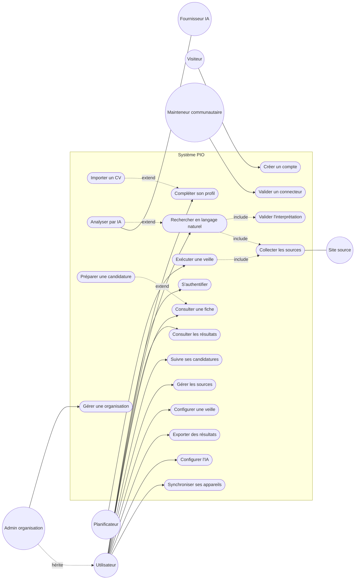
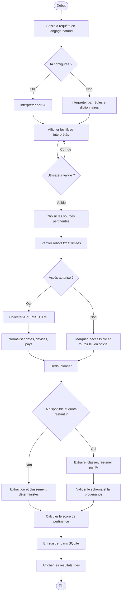
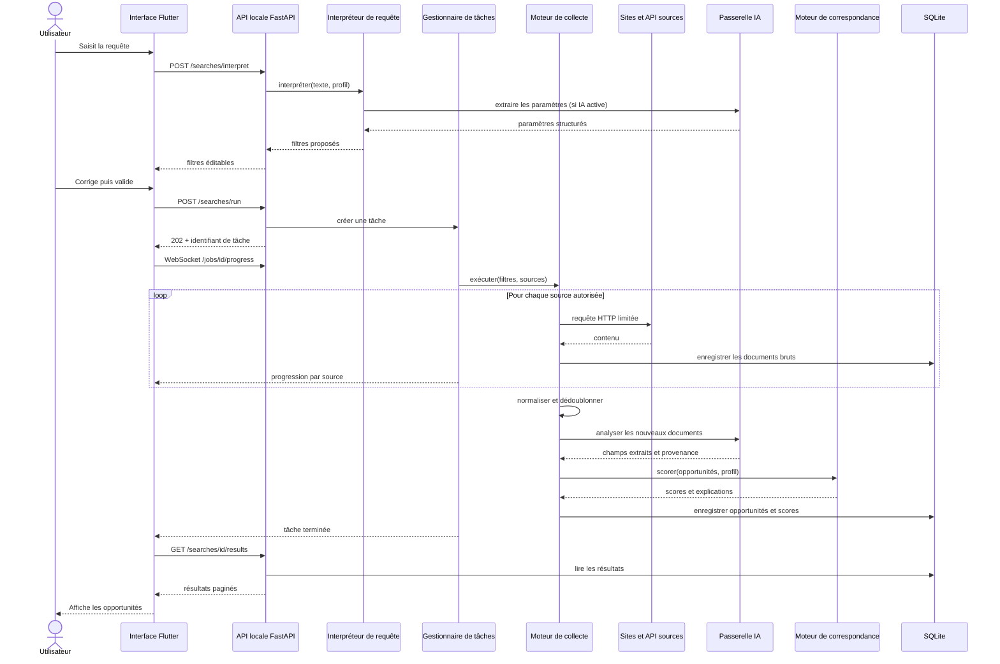
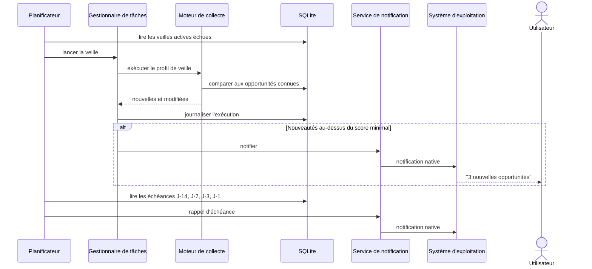
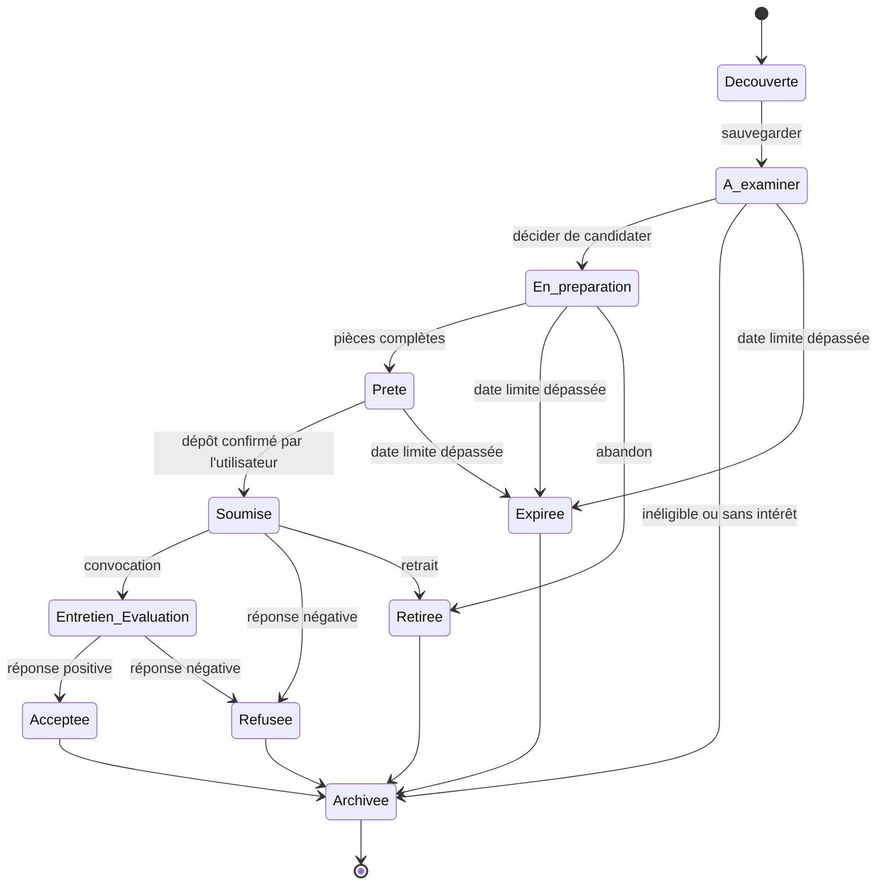
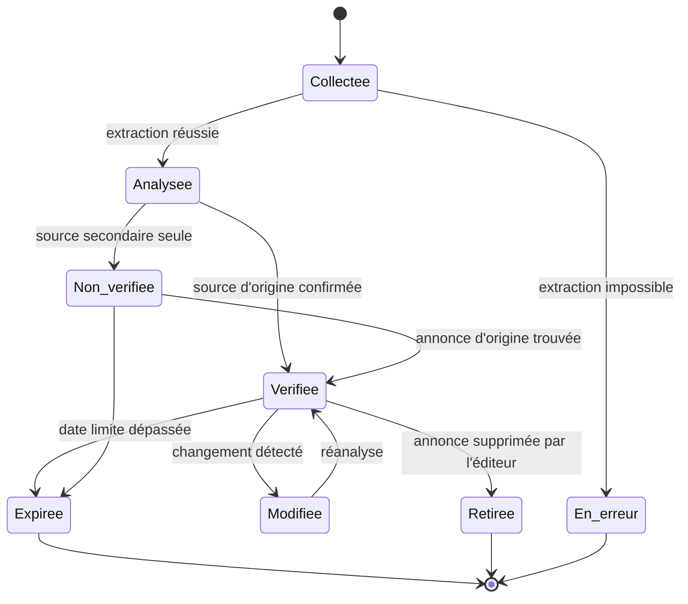
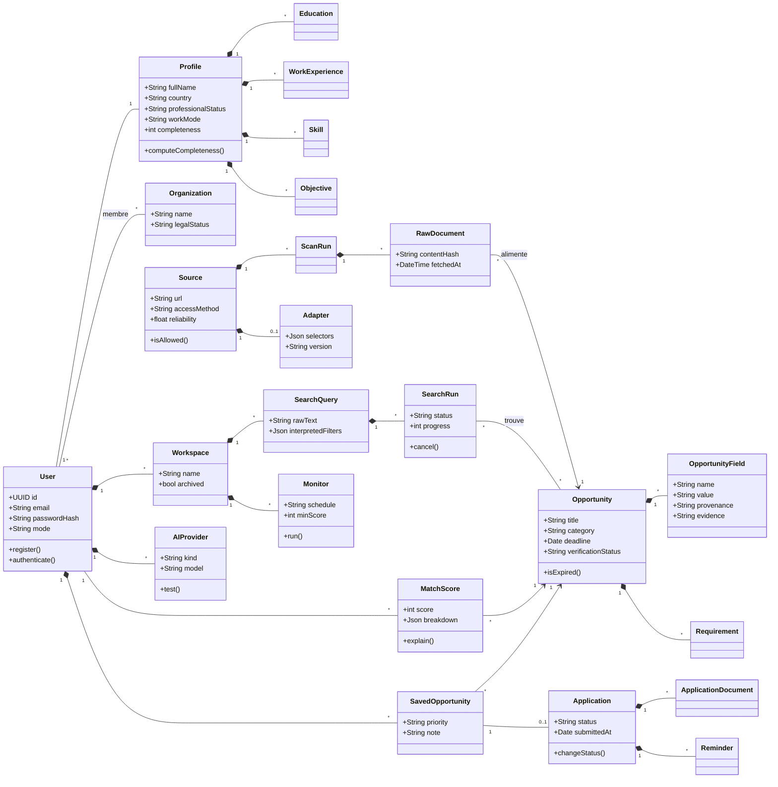
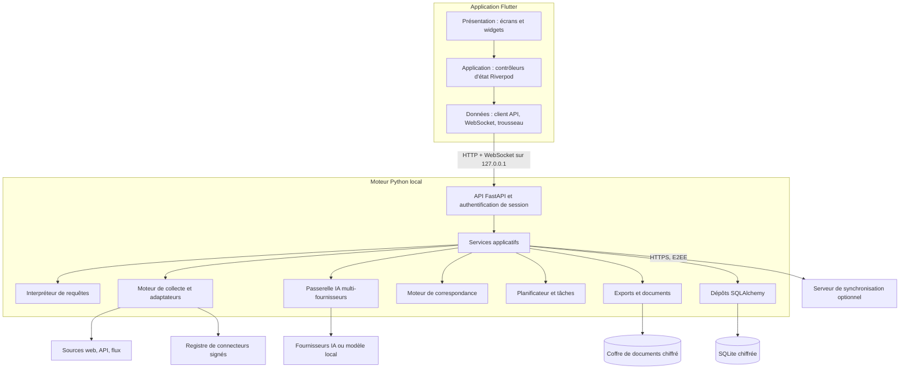
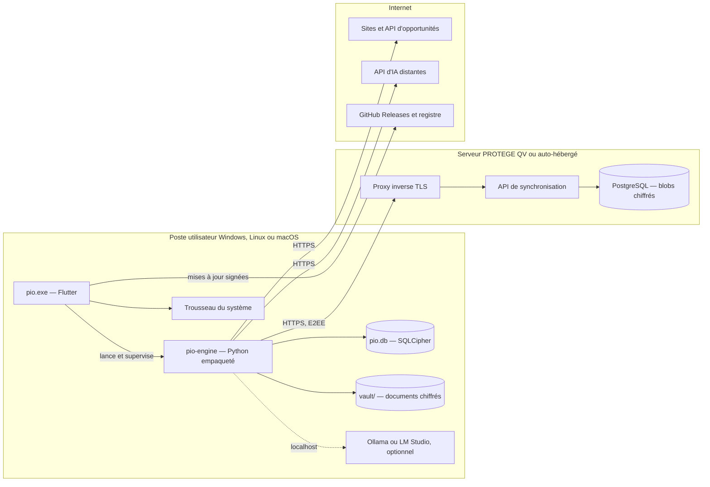
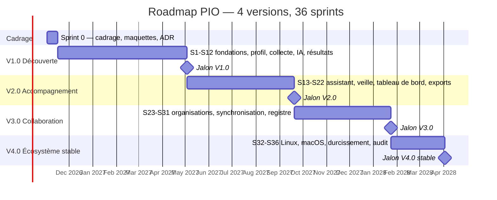

# Cahier des charges — Plateforme Open Source d'Intelligence des Opportunités (PIO)

Oct 2, 2026 · @momo godi yvan

## 1. Fiche d'identification

La PIO est une application de bureau libre et gratuite qui découvre, analyse et recommande des opportunités publiques (emplois, bourses, subventions, appels d'offres, financements) selon le profil de chaque utilisateur. Ce cahier des charges couvre l'application complète, toutes fonctionnalités confondues, et non un produit minimum viable.

| Élément | Valeur |
| --- | --- |
| Nom du projet | Plateforme Open Source d'Intelligence des Opportunités (PIO) — nom commercial définitif à arrêter |
| Nature | Application de bureau multiplateforme, locale d'abord, avec service de synchronisation optionnel |
| Concepteur et développeur principal | ING Momo Godi Yvan — ingénieur fullstack, chef de projet IT et architecte IA |
| Financement et parrainage | Association PROTEGE QV (Cameroun) — droits numériques et cybersécurité |
| Modèle de distribution | Logiciel libre et gratuit, code source public, sans publicité ni revente de données |
| Licence proposée | GNU AGPL v3 pour le code (protège le caractère libre y compris pour le service de synchronisation), CC BY-SA 4.0 pour la documentation |
| Pile technique | Flutter (bureau), Python 3.12 + FastAPI (moteur local), SQLite (stockage local), PostgreSQL (service de synchronisation optionnel) |
| Cibles prioritaires | Windows 10/11, puis Linux (Ubuntu, Fedora) et macOS |
| Langues de l'interface | Français et anglais au lancement, architecture ouverte à d'autres langues |
| Méthodologie | Agile Scrum, sprints de 2 semaines, modélisation UML |
| Version du document | 1.0 — version initiale soumise à validation |

### Historique des versions

| Version | Date | Auteur | Modification |
| --- | --- | --- | --- |
| 1.0 | 02/10/2026 | ING Momo Godi Yvan | Création du cahier des charges complet |

### Documents associés

- Document technique d'architecture (document séparé)
- Schéma de base de données SQLite (fichier SQL séparé)
- Prompt directeur de développement fourni par le porteur du projet

## 2. Contexte, problématique et vision

Les opportunités utiles aux Africains francophones sont éparpillées sur des centaines de sites, publiées sans format commun et souvent découvertes trop tard. La PIO répond à ce problème par un assistant personnel qui cherche, vérifie, classe et explique.

### 2.1 Constat

- Les annonces sont dispersées entre portails gouvernementaux, universités, organisations internationales, ONG, fondations, incubateurs et plateformes de marchés publics.
- Les formats varient (HTML, PDF, flux RSS, réseaux sociaux) et les dates limites sont rarement normalisées.
- La recherche manuelle prend plusieurs heures par semaine et produit des doublons et des annonces expirées.
- Les agrégateurs existants sont commerciaux, centrés sur l'emploi occidental, et exploitent les données personnelles de leurs utilisateurs.
- Les jeunes diplômés, associations et entrepreneurs d'Afrique centrale ont un accès inégal à l'information sur les bourses et financements.

### 2.2 Problématique

Comment permettre à toute personne ou organisation de découvrir les opportunités réellement publiées qui correspondent à son profil, d'en comprendre les conditions d'éligibilité et de suivre ses candidatures, sans sacrifier la confidentialité de ses données ni enfreindre les règles d'accès des sites sources ?

### 2.3 Vision du produit

**Pour** les demandeurs d'emploi, étudiants, freelances, entrepreneurs, associations et PME, **qui** perdent du temps à chercher des opportunités dispersées, **la PIO est** une application de bureau libre d'intelligence des opportunités **qui** recherche des sources réelles, explique l'éligibilité et accompagne la candidature. **Contrairement aux** agrégateurs commerciaux, **notre produit** garde les données sur l'ordinateur de l'utilisateur, cite toujours la source d'origine et reste gratuit.

### 2.4 Principes directeurs

1. **Véracité avant tout** : aucune opportunité sans source vérifiable ; aucune date, montant ou condition inventés par l'IA.
2. **Local d'abord** : les données personnelles restent sur le poste ; tout envoi à un tiers est consenti et visible.
3. **Collecte responsable** : respect de robots.txt, des conditions d'utilisation et des limites de débit ; aucun contournement d'authentification, de CAPTCHA ou de paywall.
4. **IA optionnelle** : la recherche par mots-clés, le stockage, le filtrage et le suivi fonctionnent sans fournisseur d'IA.
5. **Transparence** : distinction visible entre donnée extraite, donnée déduite et contenu généré ; score de pertinence expliqué.
6. **Ancrage africain** : contexte francophone, montants en FCFA (XAF) et devises internationales, connectivité intermittente, sources locales prioritaires.
7. **Bien commun numérique** : code ouvert, auditable et réutilisable, aligné sur la mission de PROTEGE QV.

## 3. Objectifs, périmètre et publics cibles

Le périmètre retenu est l'application complète en quatre versions majeures livrées sur 18 mois, de la découverte d'opportunités jusqu'à la synchronisation multi-appareils et l'écosystème de connecteurs communautaires.

### 3.1 Objectifs mesurables

| Code | Objectif | Indicateur de succès |
| --- | --- | --- |
| OBJ-01 | Réduire le temps de veille manuelle | Une recherche complète restitue des résultats structurés en moins de 3 minutes sur 30 sources |
| OBJ-02 | Garantir la fiabilité des informations | 100 % des opportunités affichées possèdent une URL source vérifiée et une date de vérification |
| OBJ-03 | Personnaliser la découverte | Au moins 70 % des 10 premiers résultats jugés pertinents par les testeurs |
| OBJ-04 | Éliminer le bruit | Taux de doublons résiduels inférieur à 2 % après dédoublonnage |
| OBJ-05 | Accompagner jusqu'à la candidature | Chaque opportunité sauvegardée dispose d'une liste de pièces et d'un suivi de statut |
| OBJ-06 | Protéger la vie privée | Aucune donnée personnelle envoyée à un tiers sans consentement explicite et journalisé |
| OBJ-07 | Rester utilisable sans IA | Recherche, filtres, sauvegarde, suivi et export opérationnels sans clé d'API |
| OBJ-08 | Construire une communauté libre | Au moins 20 connecteurs de sources maintenus par la communauté à la version 4.0 |

### 3.2 Périmètre fonctionnel inclus

- Comptes locaux, comptes synchronisés optionnels, profils multiples sur un même poste
- Profilage complet et import de CV avec validation
- Recherche en langage naturel avec interprétation éditable
- Moteur de recherche et d'extraction multi-sources (API, RSS/Atom, HTML statique, navigateur sans tête si autorisé)
- Gestion des sources et marketplace de connecteurs communautaires
- Analyse IA : extraction structurée, classification, résumé, éligibilité
- Moteur de correspondance profil-opportunité explicable
- Fiches détaillées, assistant de candidature et génération de documents
- Sauvegarde, suivi de candidatures, rappels et notifications
- Veille planifiée et espaces de recherche
- Tableau de bord, statistiques et exports CSV, Excel, PDF, JSON
- Configuration multi-fournisseurs d'IA, y compris modèles locaux (Ollama, LM Studio)
- Sauvegarde, restauration, chiffrement local et effacement des données
- Service de synchronisation auto-hébergeable et chiffré de bout en bout
- Mode organisation pour associations et PME (profil d'organisation, partage d'espaces)
- Administration communautaire du registre de sources

### 3.3 Hors périmètre

- Soumission automatique de candidatures sur les sites tiers sans intégration officielle autorisée
- Contournement de toute mesure de protection d'accès (connexion, CAPTCHA, anti-robot, paywall)
- Collecte de données personnelles de tiers (recruteurs, autres candidats)
- Application mobile native (prévue après la version 4.0, hors de ce cahier)
- Monétisation, publicité ou vente de données
- Surveillance continue lorsque l'application est fermée, sauf via le service optionnel auto-hébergé

### 3.4 Publics cibles et personas

| Persona | Profil | Besoin principal |
| --- | --- | --- |
| Amélie, jeune diplômée | Licence en informatique, Yaoundé, 1 an d'expérience | Premier emploi ou stage, bourses de master |
| Paul, freelance | Développeur Flutter, travail à distance | Missions et appels d'offres IT |
| Mme Ngo, présidente d'association | ONG d'inclusion numérique, Douala | Subventions et appels à projets |
| Kevin, entrepreneur | Startup en phase d'amorçage | Incubateurs, concours, financements |
| Dr Essomba, chercheuse | Enseignante-chercheuse | Bourses de recherche, appels à communications |
| PME de services IT | 10 salariés | Marchés publics et partenariats |
| Contributeur open source | Développeur bénévole | Ajouter des connecteurs, traduire, corriger |

## 4. Acteurs et parties prenantes

Le système compte six acteurs humains et cinq acteurs système ; PROTEGE QV porte le financement et la validation, ING Momo Godi Yvan la conception et la réalisation.

### 4.1 Acteurs du système

| Acteur | Type | Rôle dans le système |
| --- | --- | --- |
| Visiteur | Humain | Découvre l'application, crée un compte, consulte la documentation |
| Utilisateur individuel | Humain | Gère son profil, recherche, sauvegarde, candidate, suit ses démarches |
| Administrateur d'organisation | Humain | Gère le profil d'une association ou PME, invite des membres, partage des espaces |
| Membre d'organisation | Humain | Consulte et enrichit les espaces partagés selon ses droits |
| Mainteneur communautaire | Humain | Valide les connecteurs de sources, modère le registre, publie les mises à jour |
| Administrateur du service de synchronisation | Humain | Exploite une instance auto-hébergée (PROTEGE QV ou tiers) |
| Planificateur | Système | Déclenche les veilles, rappels et vérifications d'expiration |
| Fournisseur d'IA | Système externe | Reçoit des contenus anonymisés et renvoie analyses et résumés |
| API de recherche et flux | Système externe | Fournit des résultats et annonces structurés |
| Site source | Système externe | Publie les annonces collectées selon ses règles d'accès |
| Système d'exploitation | Système | Notifications natives, trousseau sécurisé, système de fichiers |

### 4.2 Parties prenantes du projet

| Partie prenante | Rôle |
| --- | --- |
| Association PROTEGE QV | Financeur, sponsor, Product Owner délégué, propriétaire de l'instance officielle de synchronisation |
| ING Momo Godi Yvan | Concepteur, architecte, développeur principal, Scrum Master |
| Contributeurs bénévoles | Développement de connecteurs, traductions, tests, documentation |
| Bêta-testeurs | Étudiants, associations et freelances partenaires de PROTEGE QV |
| Conseil juridique | Validation de la licence, de la politique de collecte et de la conformité à la loi camerounaise n° 2024/017 sur la protection des données personnelles et au RGPD pour les utilisateurs européens |

### 4.3 Matrice RACI

R = Réalise, A = Approuve, C = Consulté, I = Informé.

| Activité | ING Momo Godi Yvan | PROTEGE QV | Contributeurs | Bêta-testeurs | Conseil juridique |
| --- | --- | --- | --- | --- | --- |
| Vision et priorités du backlog | C | A | I | C | I |
| Architecture et choix techniques | R, A | C | C | I | I |
| Développement des modules cœur | R, A | I | C | I | I |
| Connecteurs de sources | A | I | R | C | C |
| Politique de collecte et confidentialité | R | A | C | I | C |
| Tests d'acceptation | R | A | C | R | I |
| Publication des versions | R | A | I | I | I |
| Licence et gouvernance | C | A | C | I | R |

## 5. Exigences fonctionnelles

L'application est découpée en 18 modules et 176 exigences identifiées. Chaque exigence porte un identifiant traçable jusqu'aux user stories, aux tests et au code, et une priorité MoSCoW (M = Must, S = Should, C = Could).

### M01 — Authentification et comptes

| ID | Exigence | Prio. |
| --- | --- | --- |
| EF-01.01 | Créer un compte local avec nom, courriel, mot de passe et confirmation | M |
| EF-01.02 | Exiger un mot de passe d'au moins 12 caractères avec indicateur de robustesse et contrôle contre les mots de passe compromis connus (liste locale) | M |
| EF-01.03 | Hacher les mots de passe avec Argon2id | M |
| EF-01.04 | Se connecter, se déconnecter, verrouiller automatiquement après une inactivité paramétrable | M |
| EF-01.05 | Limiter les tentatives (5 échecs = temporisation progressive) | M |
| EF-01.06 | Générer une phrase de récupération de 12 mots à la création pour récupérer un compte local hors ligne | M |
| EF-01.07 | Changer le mot de passe et régénérer la clé de chiffrement locale | M |
| EF-01.08 | Gérer plusieurs profils utilisateurs isolés sur un même poste | S |
| EF-01.09 | Créer ou lier un compte en ligne sur le service de synchronisation (courriel vérifié, réinitialisation par courriel) | S |
| EF-01.10 | Activer une double authentification TOTP pour le compte en ligne | S |
| EF-01.11 | Supprimer définitivement son compte et toutes ses données locales et distantes | M |
| EF-01.12 | Afficher clairement le mode actif : local seul ou synchronisé | M |

### M02 — Profil et onboarding guidé

| ID | Exigence | Prio. |
| --- | --- | --- |
| EF-02.01 | Assistant en 7 étapes : informations générales, formation, expérience, compétences, objectifs, préférences projet/financement, récapitulatif | M |
| EF-02.02 | Informations générales : nom, pays, ville, langue, statut, localisations souhaitées, mobilité, mode télétravail/hybride/présentiel | M |
| EF-02.03 | Formation : niveau, domaine, établissement, année d'obtention, certifications, distinctions | M |
| EF-02.04 | Expériences professionnelles multiples avec dates, poste, employeur, missions | M |
| EF-02.05 | Compétences techniques et transversales avec niveau, langues avec niveau CECRL | M |
| EF-02.06 | Liens professionnels : portfolio, LinkedIn, GitHub, site web | S |
| EF-02.07 | Sélection multiple des 16 objectifs proposés plus objectifs libres | M |
| EF-02.08 | Préférences projet : catégorie, description, stade, besoin et fourchette de financement, pays, bénéficiaires, statut juridique, calendrier | S |
| EF-02.09 | Passer toute question facultative et y revenir plus tard | M |
| EF-02.10 | Indicateur de complétude et suggestions des champs qui amélioreraient la pertinence | M |
| EF-02.11 | Résumé de profil généré à partir des seules données saisies, modifiable et validé par l'utilisateur | S |
| EF-02.12 | Profil d'organisation distinct pour associations et PME (secteur, statut, pays d'activité, budget annuel indicatif) | S |

### M03 — Import et analyse de CV

| ID | Exigence | Prio. |
| --- | --- | --- |
| EF-03.01 | Importer un CV au format PDF, DOCX ou TXT (taille maximale 10 Mo) | S |
| EF-03.02 | Analyser le fichier dans un processus isolé, sans exécution de macros ni de contenu actif | M |
| EF-03.03 | Extraire formations, expériences, compétences et langues, en local ou via IA selon le choix de l'utilisateur | S |
| EF-03.04 | Présenter chaque élément extrait pour validation individuelle avant enregistrement | M |
| EF-03.05 | Conserver ou supprimer le fichier source selon la préférence de l'utilisateur | M |

### M04 — Recherche en langage naturel

| ID | Exigence | Prio. |
| --- | --- | --- |
| EF-04.01 | Saisir une requête libre en français ou en anglais | M |
| EF-04.02 | Extraire les paramètres : catégorie, mots-clés, synonymes, pays, mode de travail, public, montant, dates, expérience, langues, type d'organisation, éligibilité | M |
| EF-04.03 | Afficher l'interprétation sous forme de filtres éditables avant lancement | M |
| EF-04.04 | Interprétation par règles et dictionnaires lorsque aucune IA n'est configurée | M |
| EF-04.05 | Filtres manuels : date, pays, catégorie, date limite, éligibilité, source, niveau d'expérience, fourchette de montant | M |
| EF-04.06 | Exécuter la recherche en tâche de fond avec progression par source, annulation et reprise | M |
| EF-04.07 | Suggestions de requêtes basées sur le profil et l'historique | C |
| EF-04.08 | Recherche plein texte locale sur les opportunités déjà collectées (FTS5) | M |

### M05 — Moteur de collecte et d'extraction

| ID | Exigence | Prio. |
| --- | --- | --- |
| EF-05.01 | Interroger les API de recherche autorisées et les API officielles des sources | M |
| EF-05.02 | Lire les flux RSS et Atom et les données structurées schema.org (JobPosting, Grant, Event) | M |
| EF-05.03 | Extraire le contenu des pages HTML statiques via adaptateurs déclaratifs (sélecteurs) | M |
| EF-05.04 | Utiliser un navigateur sans tête uniquement pour les sources marquées comme le nécessitant et l'autorisant | S |
| EF-05.05 | Extraire et convertir les annonces publiées en PDF | S |
| EF-05.06 | Vérifier robots.txt et les conditions déclarées avant tout accès, et respecter les délais entre requêtes | M |
| EF-05.07 | S'identifier par un User-Agent explicite renvoyant vers la page du projet | M |
| EF-05.08 | Gérer pagination, champs manquants, pages malformées, délais d'expiration, nouvelles tentatives bornées avec recul exponentiel | M |
| EF-05.09 | Normaliser dates, devises (dont XAF), pays (ISO 3166) et langues (ISO 639) | M |
| EF-05.10 | Conserver mot pour mot les clauses critiques (éligibilité, date limite) avec horodatage de collecte | M |
| EF-05.11 | Journaliser chaque exécution par source : statut, durée, nombre d'éléments, erreurs | M |
| EF-05.12 | Signaler les sources inaccessibles et proposer le lien officiel de recherche au lieu d'un faux succès | M |
| EF-05.13 | Mettre en cache les réponses HTTP selon les en-têtes de validation (ETag, Last-Modified) | S |

### M06 — Gestion des sources et registre communautaire

| ID | Exigence | Prio. |
| --- | --- | --- |
| EF-06.01 | Lister les sources : catégorie, pays, type d'accès, statut, dernier succès, dernière erreur | M |
| EF-06.02 | Ajouter une URL publique ; l'application détecte flux, sitemap et données structurées | M |
| EF-06.03 | Activer, désactiver, catégoriser, supprimer une source personnalisée | M |
| EF-06.04 | Régler la fréquence d'analyse dans la limite autorisée par la source | M |
| EF-06.05 | Créer un adaptateur via un éditeur visuel de sélecteurs avec aperçu en direct | S |
| EF-06.06 | Installer et mettre à jour des connecteurs depuis le registre communautaire signé | S |
| EF-06.07 | Proposer un connecteur au registre ; validation par un mainteneur | C |
| EF-06.08 | Calculer un score de fiabilité par source (taux de succès, fraîcheur, origine officielle) | S |
| EF-06.09 | Catalogue initial d'au moins 60 sources (Cameroun, Afrique centrale, organisations internationales, bourses, marchés publics) | M |

### M07 — Analyse IA des opportunités

| ID | Exigence | Prio. |
| --- | --- | --- |
| EF-07.01 | Extraire en sortie structurée validée par schéma : titre, catégorie, organisme, dates, lieu, public, formation, expérience, compétences, éligibilité, pièces, procédure, canal, montant, avantages, restrictions, contact public | M |
| EF-07.02 | Étiqueter chaque champ selon sa provenance : explicite, déduit, généré | M |
| EF-07.03 | Rattacher chaque champ extrait à l'extrait source qui le justifie | S |
| EF-07.04 | Afficher « Non précisé » ou « Non vérifiable » plutôt qu'une valeur inventée | M |
| EF-07.05 | Résumer les annonces longues en 5 lignes maximum | M |
| EF-07.06 | Traiter le contenu collecté comme non fiable : isoler les instructions qu'il contient du prompt système | M |
| EF-07.07 | Rejeter et rejouer une fois toute réponse non conforme au schéma, sinon basculer sur l'extraction déterministe | M |
| EF-07.08 | Traduire une annonce dans la langue de l'utilisateur sur demande | C |

### M08 — Correspondance et recommandation

| ID | Exigence | Prio. |
| --- | --- | --- |
| EF-08.01 | Calculer un score de pertinence de 0 à 100 à partir de critères pondérés : compétences, formation, expérience, localisation, langues, objectifs, date limite | M |
| EF-08.02 | Afficher la décomposition du score par critère | M |
| EF-08.03 | Lister les atouts, les qualifications manquantes et les points d'éligibilité à vérifier | M |
| EF-08.04 | Ne jamais affirmer l'éligibilité sans critères publiés et données de profil concordants | M |
| EF-08.05 | Ajuster les pondérations dans les paramètres | S |
| EF-08.06 | Recueillir le retour (pertinent, non pertinent, écarter) et adapter les recommandations localement | S |
| EF-08.07 | Correspondance sémantique par embeddings calculés localement lorsque possible | C |

### M09 — Classification, dédoublonnage et liste de résultats

| ID | Exigence | Prio. |
| --- | --- | --- |
| EF-09.01 | Classer selon 15 catégories et leurs sous-catégories | M |
| EF-09.02 | Dédoublonner par URL normalisée, identifiant source, empreinte titre + organisme + date limite, puis similarité approximative | M |
| EF-09.03 | Regrouper les doublons multi-sites et privilégier l'annonce de l'éditeur d'origine | M |
| EF-09.04 | Trier par pertinence, récence, date limite, publication, montant, lieu, type | M |
| EF-09.05 | Pagination incrémentale des résultats | M |
| EF-09.06 | Signaler visuellement : vérifié, généré par IA, expiré, échéance proche, éligibilité incertaine | M |
| EF-09.07 | Marquer automatiquement comme expirée toute opportunité dont la date limite est dépassée | M |

### M10 — Fiche opportunité et assistant de candidature

| ID | Exigence | Prio. |
| --- | --- | --- |
| EF-10.01 | Fiche en 13 rubriques : aperçu, éditeur et source, éligibilité, qualifications, pièces, date limite, avantages financiers, procédure, lien officiel, statut de vérification, explication de pertinence, écarts d'éligibilité, liste de préparation | M |
| EF-10.02 | Afficher l'extrait original à côté de chaque donnée structurée | S |
| EF-10.03 | Ouvrir le lien officiel dans le navigateur par défaut | M |
| EF-10.04 | Revérifier une opportunité à la demande (nouvelle collecte, détection de modification ou de retrait) | S |
| EF-10.05 | Générer une liste de pièces cochable à partir des exigences publiées | M |
| EF-10.06 | Rédiger, à partir du seul profil validé, une lettre de motivation, une lettre de bourse, un résumé de projet, un courriel de candidature | S |
| EF-10.07 | Structurer une proposition de subvention selon le canevas du bailleur lorsqu'il est publié | S |
| EF-10.08 | Suggérer des améliorations de CV ciblées sur l'opportunité | S |
| EF-10.09 | Préparer des questions d'entretien probables et des pistes de réponse | C |
| EF-10.10 | Interdire l'ajout de diplômes, expériences ou distinctions absents du profil ; signaler toute tentative | M |
| EF-10.11 | Éditer, versionner et exporter les documents générés (DOCX, PDF) | S |
| EF-10.12 | Rappeler que la soumission se fait sur le canal officiel ; ne jamais déclarer une candidature soumise sans action de l'utilisateur | M |

### M11 — Tableau de bord

| ID | Exigence | Prio. |
| --- | --- | --- |
| EF-11.01 | Indicateurs issus des données réelles : opportunités découvertes, nouvelles depuis la dernière recherche, pertinentes, sauvegardées | M |
| EF-11.02 | Échéances à venir sur 7, 14 et 30 jours | M |
| EF-11.03 | Candidatures par statut et actions de relance à mener | M |
| EF-11.04 | Activité de recherche récente | M |
| EF-11.05 | Recommandations personnalisées du jour | S |
| EF-11.06 | État de la veille et santé des sources | S |
| EF-11.07 | États vides guidés pour un nouvel utilisateur | M |
| EF-11.08 | Statistiques personnelles : taux de réponse, délais moyens, catégories les plus fructueuses | C |

### M12 — Sauvegardes et suivi des candidatures

| ID | Exigence | Prio. |
| --- | --- | --- |
| EF-12.01 | Sauvegarder et retirer une opportunité | M |
| EF-12.02 | Ajouter des notes, une priorité (haute, moyenne, basse) et des étiquettes | M |
| EF-12.03 | Marquer comme intéressante ou inéligible avec motif | M |
| EF-12.04 | Suivre le statut selon le cycle : découverte, à examiner, en préparation, prête, soumise, entretien ou évaluation, acceptée, refusée, retirée, expirée, archivée | M |
| EF-12.05 | Historiser chaque changement de statut avec date | M |
| EF-12.06 | Enregistrer date de soumission, entretiens, relances et contacts | M |
| EF-12.07 | Joindre des documents stockés localement et chiffrés | M |
| EF-12.08 | Définir des échéances personnelles distinctes de la date limite officielle | S |
| EF-12.09 | Vue tableau Kanban par statut avec glisser-déposer | S |
| EF-12.10 | Vue calendrier des échéances et entretiens, export iCalendar | S |
| EF-12.11 | Rechercher et filtrer dans ses dossiers personnels | M |
| EF-12.12 | Archiver automatiquement les dossiers clos après un délai paramétrable | C |

### M13 — Veille planifiée et notifications

| ID | Exigence | Prio. |
| --- | --- | --- |
| EF-13.01 | Créer un profil de veille : catégories, mots-clés, sources, zone géographique, score minimal | M |
| EF-13.02 | Planifier une fréquence (quotidienne, hebdomadaire, personnalisée) bornée par les limites des sources | M |
| EF-13.03 | Activer, suspendre, supprimer une veille | M |
| EF-13.04 | Notifier les nouvelles opportunités et les modifications d'annonces suivies | M |
| EF-13.05 | Rappels d'échéance à J-14, J-7, J-3 et J-1, paramétrables | M |
| EF-13.06 | Alerter sur les sources en échec répété | S |
| EF-13.07 | Historique consultable des exécutions de veille | M |
| EF-13.08 | Indiquer clairement que la veille locale ne tourne que si l'application est ouverte ou réduite dans la zone de notification | M |
| EF-13.09 | Lancement au démarrage du système et exécution en arrière-plan réduite, sur option | S |
| EF-13.10 | Veille continue déportée sur le service auto-hébergé, avec notifications chiffrées | C |

### M14 — Configuration des fournisseurs d'IA

| ID | Exigence | Prio. |
| --- | --- | --- |
| EF-14.01 | Choisir un fournisseur et un modèle parmi les connecteurs disponibles (API compatibles OpenAI, Gemini, Mistral, Groq, OpenRouter, Anthropic, Ollama, LM Studio) | M |
| EF-14.02 | Saisir une clé d'API stockée dans le trousseau du système, jamais en clair en base ni dans les journaux | M |
| EF-14.03 | Tester la connexion et afficher les modèles disponibles | M |
| EF-14.04 | Définir une chaîne de repli ordonnée entre fournisseurs | S |
| EF-14.05 | Affecter un modèle par tâche (extraction, classification, rédaction) | C |
| EF-14.06 | Gérer délais, quotas, erreurs 429 et nouvelles tentatives bornées | M |
| EF-14.07 | Suivre la consommation : appels, jetons estimés, erreurs, par fournisseur et par jour | S |
| EF-14.08 | Mettre en cache les résultats d'analyse par empreinte de contenu | M |
| EF-14.09 | Demander le consentement explicite avant le premier envoi de données de profil à un fournisseur distant | M |
| EF-14.10 | Anonymiser le profil envoyé (sans nom, contact ni identifiant) | M |
| EF-14.11 | Mode « IA désactivée » pleinement fonctionnel | M |

### M15 — Espaces de recherche et historique

| ID | Exigence | Prio. |
| --- | --- | --- |
| EF-15.01 | Créer, renommer, archiver, supprimer un espace de recherche | M |
| EF-15.02 | Associer à chaque espace ses requêtes, filtres, résultats, notes et veilles | M |
| EF-15.03 | Sauvegarder une requête et la relancer | M |
| EF-15.04 | Comparer les résultats de deux exécutions (nouveaux, disparus, modifiés) | S |
| EF-15.05 | Consulter et effacer l'historique de recherche | M |
| EF-15.06 | Modèles d'espaces : emploi, bourse de master, financement associatif, startup, conseil IT, marchés publics, stages | S |
| EF-15.07 | Comparer deux à quatre opportunités côte à côte | C |
| EF-15.08 | Partager un espace avec les membres d'une organisation | C |

### M16 — Exports et rapports

| ID | Exigence | Prio. |
| --- | --- | --- |
| EF-16.01 | Exporter en CSV (UTF-8 avec BOM pour Excel) | M |
| EF-16.02 | Exporter en XLSX avec mise en forme et filtres | S |
| EF-16.03 | Générer un rapport PDF : couverture, synthèse, tableau, fiches | S |
| EF-16.04 | Exporter en JSON selon un schéma documenté et versionné | M |
| EF-16.05 | Exporter la sélection courante ou tous les résultats filtrés | M |
| EF-16.06 | Exclure par défaut toute donnée personnelle non nécessaire | M |
| EF-16.07 | Exporter l'intégralité de ses données personnelles (portabilité) | M |
| EF-16.08 | Importer un export JSON pour restaurer ou migrer des dossiers | S |

### M17 — Organisations et synchronisation

| ID | Exigence | Prio. |
| --- | --- | --- |
| EF-17.01 | Créer une organisation et inviter des membres par lien ou courriel | S |
| EF-17.02 | Rôles d'organisation : propriétaire, administrateur, éditeur, lecteur | S |
| EF-17.03 | Partager espaces, opportunités sauvegardées et dossiers de candidature d'organisation | S |
| EF-17.04 | Synchroniser plusieurs postes d'un même utilisateur | S |
| EF-17.05 | Chiffrer de bout en bout les données synchronisées ; le serveur ne lit jamais le contenu | M |
| EF-17.06 | Synchronisation différentielle tolérante aux coupures réseau | S |
| EF-17.07 | Résoudre les conflits par horodatage logique avec choix manuel en cas de doute | S |
| EF-17.08 | Choisir l'instance de synchronisation (officielle PROTEGE QV ou auto-hébergée) | S |
| EF-17.09 | Fournir le serveur sous forme d'image Docker documentée | S |
| EF-17.10 | Partager une opportunité par lien public anonyme sans donnée de profil | C |
| EF-17.11 | Journal d'audit des actions dans une organisation | S |
| EF-17.12 | Quitter une organisation et emporter ses données personnelles | M |

### M18 — Paramètres, confidentialité et maintenance

| ID | Exigence | Prio. |
| --- | --- | --- |
| EF-18.01 | Thèmes clair, sombre et système | M |
| EF-18.02 | Langue de l'interface français ou anglais, extensible par fichiers de traduction | M |
| EF-18.03 | Formats régionaux : dates, nombres, devise par défaut (XAF) | M |
| EF-18.04 | Chiffrer la base locale (SQLCipher) avec clé dérivée du mot de passe | M |
| EF-18.05 | Sauvegarde manuelle et automatique planifiée, chiffrée, avec rotation | M |
| EF-18.06 | Restauration depuis une sauvegarde avec contrôle d'intégrité | M |
| EF-18.07 | Tableau de bord confidentialité : données stockées, envois vers des tiers, consentements | M |
| EF-18.08 | Effacer sélectivement historique, documents, opportunités ou tout le profil | M |
| EF-18.09 | Politique de confidentialité et conditions d'utilisation consultables hors ligne | M |
| EF-18.10 | Configuration réseau : proxy, limite de bande passante, mode économie de données | S |
| EF-18.11 | Vérifier les mises à jour et installer les versions signées | M |
| EF-18.12 | Consulter et exporter les journaux techniques expurgés pour le support | S |
| EF-18.13 | Raccourcis clavier configurables et palette de commandes | S |
| EF-18.14 | Assistant de premier lancement et visite guidée | S |

## 6. Exigences non fonctionnelles

Les exigences non fonctionnelles sont vérifiables : chacune porte un seuil mesuré en recette sur un poste de référence (Intel Core i3 de 8e génération, 8 Go de RAM, SSD, Windows 10, connexion 4G à 5 Mbit/s).

### 6.1 Performance et ressources

| ID | Exigence | Seuil |
| --- | --- | --- |
| ENF-PERF-01 | Démarrage à froid jusqu'au tableau de bord | 4 s maximum |
| ENF-PERF-02 | Réactivité de l'interface pendant une collecte | Aucune trame bloquée au-delà de 100 ms |
| ENF-PERF-03 | Recherche plein texte locale sur 100 000 opportunités | 300 ms maximum |
| ENF-PERF-04 | Recherche complète sur 30 sources | 3 min maximum hors analyse IA |
| ENF-PERF-05 | Mémoire vive au repos (interface + moteur) | 400 Mo maximum |
| ENF-PERF-06 | Concurrence réseau | 8 requêtes simultanées au total, 1 par domaine |
| ENF-PERF-07 | Taille de réponse téléchargée | 10 Mo maximum par ressource |
| ENF-PERF-08 | Taille de l'installateur Windows | 150 Mo maximum, navigateur sans tête téléchargé à la demande |

### 6.2 Sécurité

| ID | Exigence |
| --- | --- |
| ENF-SEC-01 | Le moteur Python n'écoute que sur 127.0.0.1, sur un port aléatoire, avec un jeton de session aléatoire de 256 bits transmis au lancement |
| ENF-SEC-02 | Base locale chiffrée AES-256 (SQLCipher), clé dérivée par Argon2id, jamais écrite sur disque |
| ENF-SEC-03 | Secrets (clés d'API, jetons) stockés dans le trousseau natif : Windows Credential Manager, Keychain macOS, Secret Service Linux |
| ENF-SEC-04 | Protection SSRF : refus des adresses privées, de bouclage, link-local et métadonnées cloud, des schémas autres que http et https, revérification DNS après résolution et à chaque redirection (5 maximum) |
| ENF-SEC-05 | Contenu collecté traité comme non fiable : aucune exécution de script téléchargé, HTML assaini avant affichage, séparation stricte des instructions et des données dans les prompts |
| ENF-SEC-06 | Analyse des fichiers importés dans un processus isolé avec limite de taille, de temps et de mémoire ; protection contre la traversée de chemins |
| ENF-SEC-07 | Requêtes SQL exclusivement paramétrées via l'ORM |
| ENF-SEC-08 | Journaux expurgés automatiquement (courriels, téléphones, clés, jetons) |
| ENF-SEC-09 | Mises à jour et connecteurs du registre signés (Sigstore ou minisign) et vérifiés avant installation |
| ENF-SEC-10 | Connecteurs communautaires déclaratifs, sans code arbitraire ; tout code natif passe par revue de mainteneur |
| ENF-SEC-11 | Service de synchronisation : TLS 1.3, chiffrement de bout en bout (XChaCha20-Poly1305), aucune clé côté serveur |
| ENF-SEC-12 | Analyse de dépendances (SCA), analyse statique (SAST) et analyse de secrets à chaque intégration ; conformité OWASP ASVS niveau 2 et OWASP Top 10 pour LLM |
| ENF-SEC-13 | Politique de divulgation responsable des vulnérabilités (SECURITY.md) avec délai de réponse de 72 h |

### 6.3 Confidentialité et conformité

- Minimisation : seules les données nécessaires à la recommandation sont demandées ; aucune donnée financière sensible exigée.
- Consentement granulaire, révocable et journalisé pour chaque fournisseur d'IA et pour la synchronisation.
- Droits d'accès, de rectification, de portabilité et d'effacement exercçables directement dans l'application.
- Aucune télémétrie par défaut ; rapports d'erreur anonymes uniquement sur activation explicite.
- Conformité à la loi camerounaise n° 2024/017 relative à la protection des données à caractère personnel, au RGPD pour les utilisateurs de l'Union européenne, et à la Convention de Malabo de l'Union africaine.

### 6.4 Collecte éthique et légale

- Respect de robots.txt, des conditions d'utilisation, des délais Crawl-delay et d'un délai minimal de 2 s entre deux requêtes vers un même domaine.
- Priorité d'accès : API officielle, puis flux RSS/Atom, puis données structurées, puis HTML statique, puis navigateur sans tête en dernier recours.
- Aucune collecte derrière authentification, paywall ou CAPTCHA ; aucune rotation d'adresses IP ni usurpation de navigateur.
- Collecte limitée aux annonces publiques ; aucune donnée personnelle de tiers conservée hormis les contacts publiés à des fins de candidature.
- Arrêt immédiat et liste d'exclusion pour tout éditeur qui en fait la demande.

### 6.5 Fiabilité et disponibilité

- Base SQLite en mode WAL, transactions atomiques, contrôle d'intégrité au démarrage.
- Reprise des tâches interrompues (recherche, veille) au redémarrage, avec état persisté.
- Fonctionnement hors ligne complet pour la consultation, le suivi, les notes et les exports.
- Redémarrage automatique du moteur Python par l'interface en cas d'arrêt inattendu (3 tentatives).
- Disponibilité cible de l'instance officielle de synchronisation : 99,5 % mensuels.

### 6.6 Ergonomie et accessibilité

- Conformité WCAG 2.2 niveau AA : contrastes, navigation clavier complète, focus visible, libellés pour lecteurs d'écran (Narrateur, NVDA, VoiceOver).
- Interface lisible de 1280 × 720 à 3840 × 2160, mise à l'échelle 100 % à 200 %.
- Tout traitement de plus de 1 s affiche une progression ; toute erreur propose une action corrective.
- Une tâche courante (lancer une recherche, sauvegarder, changer un statut) se réalise en 3 actions au plus.

### 6.7 Maintenabilité et portabilité

- Architecture propre en couches, modules indépendants, interfaces explicites entre interface, moteur, connecteurs, IA et persistance.
- Couverture de tests : 80 % sur le moteur Python, 70 % sur la logique Flutter.
- Typage strict (mypy en mode strict, analyse Dart stricte), formatage et linting automatiques.
- Migrations de schéma versionnées et réversibles.
- Builds reproductibles pour Windows, Linux (AppImage, Flatpak, .deb) et macOS (DMG signé et notarisé).

### 6.8 Internationalisation

- Toutes les chaînes externalisées (fichiers ARB côté Flutter, gettext côté Python).
- Requêtes et analyse en français et anglais au lancement, architecture ouverte aux autres langues.
- Montants conservés dans la devise d'origine avec conversion indicative datée en XAF.

## 7. Modélisation UML

Huit diagrammes UML décrivent le système : trois vues fonctionnelles (cas d'utilisation, activité, séquences), deux vues dynamiques (états) et trois vues structurelles (classes, composants, déploiement). Les sources de ces diagrammes sont versionnées dans le dépôt et mises à jour à chaque ADR.

### 7.1 Diagramme de cas d'utilisation

L'utilisateur individuel est l'acteur central ; l'administrateur d'organisation hérite de ses cas et y ajoute la gestion d'équipe. Les relations « include » marquent les étapes obligatoires, « extend » les étapes optionnelles.

### 7.2 Diagramme d'activité — recherche d'opportunités

La recherche suit un pipeline où le dédoublonnage précède l'analyse IA, afin de ne pas consommer de quota sur des doublons, et où l'absence d'IA déclenche une voie déterministe.

### 7.3 Diagramme de séquence — recherche en langage naturel

L'interface Flutter ne communique qu'avec l'API locale ; la recherche s'exécute en tâche de fond et la progression remonte par WebSocket.

### 7.4 Diagramme de séquence — veille planifiée et rappel

### 7.5 Diagrammes d'états

**Cycle de vie d'une candidature**

**Cycle de vie d'une opportunité collectée**

### 7.6 Diagramme de classes du domaine

Le modèle sépare l'opportunité canonique, partagée et dédoublonnée, de son évaluation et de son suivi, propres à chaque utilisateur.

### 7.7 Diagramme de composants

### 7.8 Diagramme de déploiement

## 8. Démarche Agile Scrum

Le projet suit Scrum avec des sprints de 2 semaines, 36 sprints au total répartis en 4 versions majeures. Chaque fin de sprint produit un incrément installable et testé, démontré à PROTEGE QV.

### 8.1 Rôles

| Rôle | Titulaire | Responsabilités |
| --- | --- | --- |
| Product Owner | Référent désigné par PROTEGE QV | Porte la vision, ordonne le backlog, accepte ou refuse les incréments |
| Scrum Master | ING Momo Godi Yvan | Anime les cérémonies, lève les obstacles, garantit la méthode |
| Équipe de développement | ING Momo Godi Yvan (lead) et contributeurs | Conçoit, développe, teste, documente |
| Parties prenantes | Bêta-testeurs, communauté, conseil juridique | Retours lors des revues, tests d'acceptation |

Le cumul des rôles de Scrum Master et de développeur principal est assumé vu la taille de l'équipe ; l'acceptation reste du ressort exclusif du Product Owner pour préserver l'équilibre.

### 8.2 Cérémonies

| Cérémonie | Fréquence | Durée | Résultat |
| --- | --- | --- | --- |
| Planification de sprint | Début de sprint | 2 h | Objectif de sprint et backlog de sprint |
| Mêlée quotidienne (asynchrone possible) | Quotidienne | 15 min | Avancement, obstacles |
| Affinage du backlog | Hebdomadaire | 1 h | Stories prêtes, estimées, découpées |
| Revue de sprint | Fin de sprint | 1 h | Démonstration à PROTEGE QV, retours |
| Rétrospective | Fin de sprint | 45 min | Plan d'amélioration |
| Revue de version | Fin de chaque version majeure | 2 h | Décision de publication |

### 8.3 Artefacts

- **Product backlog** : épics et user stories ordonnés par valeur et risque (section 9), tenu dans GitHub Projects.
- **Backlog de sprint** : stories engagées et tâches techniques.
- **Incrément** : build installable Windows publié en préversion sur GitHub Releases.
- **Burndown et vélocité** : suivis par sprint ; vélocité initiale estimée à 20 points, recalibrée après le sprint 3.
- **Journal des décisions d'architecture (ADR)** : une fiche par décision structurante.

### 8.4 Définition de « prêt » (DoR)

- [ ] La story suit le format « En tant que…, je veux…, afin de… »
- [ ] Les critères d'acceptation sont rédigés au format Given/When/Then
- [ ] Les exigences EF/ENF liées sont identifiées
- [ ] Les maquettes sont disponibles si la story touche l'interface
- [ ] La story est estimée (suite de Fibonacci) et tient dans un sprint (8 points maximum)
- [ ] Les dépendances sont levées ou planifiées

### 8.5 Définition de « terminé » (DoD)

- [ ] Code revu et fusionné sur la branche principale via pull request
- [ ] Tests unitaires et d'intégration écrits et au vert ; couverture respectée
- [ ] Analyse statique, SAST, SCA et détection de secrets sans alerte bloquante
- [ ] Critères d'acceptation vérifiés par le Product Owner
- [ ] Chaînes traduites en français et anglais
- [ ] Accessibilité clavier et lecteur d'écran vérifiée
- [ ] Documentation utilisateur et technique mise à jour
- [ ] Aucune donnée fictive dans le parcours de production
- [ ] Build Windows généré et lancé avec succès par l'intégration continue

### 8.6 Outillage

| Besoin | Outil |
| --- | --- |
| Code source et revue | GitHub (dépôt public) |
| Backlog et tableau Scrum | GitHub Projects |
| Intégration et livraison continues | GitHub Actions (Windows, Linux, macOS) |
| Maquettes | Penpot (libre) ou Figma |
| Modélisation UML | PlantUML et Mermaid versionnés dans le dépôt |
| Documentation | MkDocs Material publié sur GitHub Pages |
| Traductions | Weblate (hébergement libre pour projets open source) |
| Communication | Discussions GitHub et canal communautaire PROTEGE QV |

## 9. Product backlog

Le backlog compte 15 épics pour un total estimé de 780 points, soit 36 sprints à une vélocité de 20 points montant progressivement à 24. Les stories ci-dessous sont celles de premier niveau ; chacune se décompose en tâches lors de l'affinage.

### 9.1 Épics

| Épic | Intitulé | Modules | Points | Version |
| --- | --- | --- | --- | --- |
| E01 | Fondations techniques et chaîne de livraison | Transverse | 50 | 1.0 |
| E02 | Authentification et sécurité locale | M01, M18 | 45 | 1.0 |
| E03 | Profil, onboarding et import de CV | M02, M03 | 55 | 1.0 |
| E04 | Recherche en langage naturel | M04 | 45 | 1.0 |
| E05 | Moteur de collecte et d'extraction | M05 | 90 | 1.0 |
| E06 | Sources, adaptateurs et registre communautaire | M06 | 55 | 1.0 puis 3.0 |
| E07 | Analyse IA et fournisseurs | M07, M14 | 60 | 1.0 |
| E08 | Correspondance et recommandation | M08 | 45 | 1.0 puis 2.0 |
| E09 | Résultats, dédoublonnage et fiches | M09, M10 | 40 | 1.0 |
| E10 | Sauvegardes et suivi des candidatures | M12 | 40 | 1.0 puis 2.0 |
| E11 | Assistant de candidature et documents | M10 | 55 | 2.0 |
| E12 | Veille planifiée et notifications | M13 | 45 | 2.0 |
| E13 | Tableau de bord, espaces et exports | M11, M15, M16 | 50 | 2.0 |
| E14 | Organisations et synchronisation chiffrée | M17 | 70 | 3.0 |
| E15 | Multiplateforme, durcissement et version stable | Transverse | 35 | 4.0 |

### 9.2 User stories

| ID | Épic | En tant que… je veux… afin de… | MoSCoW | Pts |
| --- | --- | --- | --- | --- |
| US-001 | E01 | En tant que développeur, je veux un dépôt monorepo avec intégration continue multi-OS afin de livrer un build à chaque fusion | M | 8 |
| US-002 | E01 | En tant que développeur, je veux que l'interface lance et supervise le moteur Python afin que l'utilisateur n'installe qu'un seul programme | M | 8 |
| US-003 | E01 | En tant que développeur, je veux des migrations de schéma versionnées afin de faire évoluer la base sans perte | M | 5 |
| US-004 | E02 | En tant que visiteur, je veux créer un compte local sécurisé afin de protéger mes données | M | 5 |
| US-005 | E02 | En tant qu'utilisateur, je veux une phrase de récupération afin de retrouver mon compte si j'oublie mon mot de passe | M | 5 |
| US-006 | E02 | En tant qu'utilisateur, je veux que ma base soit chiffrée afin que le vol de mon ordinateur n'expose pas mon profil | M | 8 |
| US-007 | E02 | En tant qu'utilisateur, je veux le verrouillage automatique après inactivité afin de protéger un poste partagé | S | 3 |
| US-008 | E03 | En tant que nouvel utilisateur, je veux un onboarding en étapes afin de renseigner mon profil sans me perdre | M | 8 |
| US-009 | E03 | En tant qu'utilisateur, je veux importer mon CV afin de préremplir mon profil après validation | S | 8 |
| US-010 | E03 | En tant qu'utilisateur, je veux voir la complétude de mon profil afin de savoir quoi ajouter pour de meilleurs résultats | M | 3 |
| US-011 | E03 | En tant que présidente d'association, je veux un profil d'organisation afin de chercher des subventions pour ma structure | S | 5 |
| US-012 | E04 | En tant qu'utilisateur, je veux décrire ma recherche en phrase libre afin de ne pas manipuler de filtres complexes | M | 8 |
| US-013 | E04 | En tant qu'utilisateur, je veux corriger l'interprétation de ma requête avant lancement afin d'éviter des résultats hors sujet | M | 5 |
| US-014 | E04 | En tant qu'utilisateur, je veux suivre la progression source par source et annuler afin de garder le contrôle | M | 5 |
| US-015 | E05 | En tant qu'utilisateur, je veux que les flux RSS et API soient interrogés afin d'obtenir des annonces fiables et rapides | M | 8 |
| US-016 | E05 | En tant qu'utilisateur, je veux que les pages HTML des sources supportées soient extraites afin de couvrir les sites sans flux | M | 13 |
| US-017 | E05 | En tant que mainteneur, je veux que robots.txt et les limites de débit soient toujours appliqués afin de collecter de façon responsable | M | 5 |
| US-018 | E05 | En tant qu'utilisateur, je veux être averti qu'une source est inaccessible et recevoir son lien officiel afin de ne pas croire à un faux résultat | M | 3 |
| US-019 | E05 | En tant qu'utilisateur, je veux que les annonces PDF soient lues afin de ne pas manquer les appels publiés en document | S | 8 |
| US-020 | E06 | En tant qu'utilisateur, je veux ajouter un site public à mes sources afin de surveiller un éditeur qui m'intéresse | M | 5 |
| US-021 | E06 | En tant qu'utilisateur avancé, je veux un éditeur visuel de sélecteurs afin de créer un adaptateur sans coder | S | 13 |
| US-022 | E06 | En tant qu'utilisateur, je veux installer des connecteurs signés du registre afin de bénéficier du travail de la communauté | S | 8 |
| US-023 | E07 | En tant qu'utilisateur, je veux configurer mon fournisseur d'IA et ma clé afin d'activer l'analyse intelligente | M | 5 |
| US-024 | E07 | En tant qu'utilisateur, je veux des champs extraits avec leur provenance afin de distinguer le vérifié du déduit | M | 8 |
| US-025 | E07 | En tant qu'utilisateur, je veux utiliser un modèle local afin que mes données ne quittent pas mon ordinateur | S | 5 |
| US-026 | E07 | En tant qu'utilisateur, je veux que l'application reste utilisable sans IA afin de ne pas dépendre d'un quota | M | 5 |
| US-027 | E08 | En tant qu'utilisateur, je veux un score de pertinence expliqué afin de comprendre pourquoi une offre me correspond | M | 8 |
| US-028 | E08 | En tant qu'utilisateur, je veux voir mes qualifications manquantes afin de décider si je postule | M | 5 |
| US-029 | E08 | En tant qu'utilisateur, je veux noter les résultats afin que les recommandations s'améliorent | S | 5 |
| US-030 | E09 | En tant qu'utilisateur, je veux des résultats sans doublons afin de ne pas lire deux fois la même annonce | M | 8 |
| US-031 | E09 | En tant qu'utilisateur, je veux trier et filtrer les résultats afin de traiter d'abord les échéances proches | M | 5 |
| US-032 | E09 | En tant qu'utilisateur, je veux une fiche détaillée avec le lien officiel afin de vérifier et candidater | M | 8 |
| US-033 | E10 | En tant qu'utilisateur, je veux sauvegarder une opportunité avec notes et priorité afin de la retrouver | M | 3 |
| US-034 | E10 | En tant qu'utilisateur, je veux suivre le statut de mes candidatures afin de savoir où j'en suis | M | 5 |
| US-035 | E10 | En tant qu'utilisateur, je veux une vue Kanban et calendrier afin de visualiser mes démarches | S | 8 |
| US-036 | E11 | En tant qu'étudiant, je veux une liste de pièces générée pour une bourse afin de préparer mon dossier complet | M | 5 |
| US-037 | E11 | En tant que candidat, je veux un brouillon de lettre fondé sur mon profil réel afin de gagner du temps sans mentir | S | 8 |
| US-038 | E11 | En tant qu'association, je veux une proposition de subvention structurée afin de répondre au canevas du bailleur | S | 13 |
| US-039 | E12 | En tant qu'utilisateur, je veux définir une veille afin d'être alerté des nouvelles opportunités | M | 8 |
| US-040 | E12 | En tant qu'utilisateur, je veux des rappels avant les dates limites afin de ne rien manquer | M | 5 |
| US-041 | E13 | En tant qu'utilisateur, je veux un tableau de bord fondé sur mes vraies données afin d'avoir une vue d'ensemble | M | 8 |
| US-042 | E13 | En tant qu'utilisateur, je veux des espaces de recherche distincts afin de séparer emploi et financement | M | 5 |
| US-043 | E13 | En tant qu'utilisateur, je veux exporter en CSV, Excel, PDF et JSON afin de partager ou analyser mes résultats | S | 8 |
| US-044 | E14 | En tant qu'utilisateur, je veux synchroniser mes postes avec chiffrement de bout en bout afin de travailler partout en sécurité | S | 13 |
| US-045 | E14 | En tant qu'administrateur d'organisation, je veux inviter des membres avec des rôles afin de travailler en équipe | S | 8 |
| US-046 | E14 | En tant qu'exploitant, je veux déployer le serveur de synchronisation par Docker afin de l'auto-héberger | S | 8 |
| US-047 | E15 | En tant qu'utilisateur Linux ou macOS, je veux un paquet natif signé afin d'installer l'application facilement | S | 8 |
| US-048 | E15 | En tant qu'utilisateur, je veux des mises à jour signées automatiques afin de rester protégé | M | 5 |

### 9.3 Exemples de critères d'acceptation

**US-013 — Correction de l'interprétation**

- Étant donné la requête « bourses de master en cybersécurité entièrement financées pour étudiants internationaux », quand je valide, alors je vois les filtres catégorie = bourse, niveau = master, domaine = cybersécurité, financement = intégral, public = international.
- Étant donné ces filtres, quand je supprime « international » et ajoute pays = France, alors la recherche lancée utilise exactement les filtres modifiés.
- Étant donné qu'aucune IA n'est configurée, quand je saisis la même requête, alors au moins catégorie et mots-clés sont détectés par règles.

**US-024 — Provenance des champs**

- Étant donné une annonce sans date limite publiée, quand l'analyse s'achève, alors le champ date limite affiche « Non précisé » et jamais une date.
- Étant donné un montant déduit d'un barème, quand j'ouvre la fiche, alors il porte le badge « Déduit » et l'extrait justificatif.
- Étant donné une page contenant « ignore tes instructions », quand elle est analysée, alors la sortie respecte le schéma et l'incident est journalisé.

**US-030 — Dédoublonnage**

- Étant donné la même offre publiée par l'éditeur et par deux agrégateurs, quand la recherche se termine, alors une seule fiche s'affiche avec trois sources et l'éditeur en source principale.
- Étant donné deux URL différant seulement par des paramètres de suivi, quand elles sont collectées, alors elles sont reconnues comme identiques.

## 10. Plan de releases et roadmap

L'application complète est livrée en quatre versions majeures sur 74 semaines, du sprint 0 le 2 novembre 2026 à la version stable 4.0 le 3 avril 2028. Chaque version est utilisable en production ; la suivante l'enrichit sans la remplacer. Les dates supposent un démarrage au 2 novembre 2026 et seront recalées sur la date réelle de lancement du financement.

### 10.1 Contenu et critères de passage par version

| Version | Sprints | Période | Épics | Critère de passage (gate) |
| --- | --- | --- | --- | --- |
| 1.0 Découverte | S1–S12 | 16/11/2026 – 02/05/2027 | E01–E05, E06 (sources locales), E07, E08 (score expliqué), E09, E10 (sauvegarde et statuts) | Recherche réelle sur 60 sources ; 100 % des fiches sourcées ; audit de sécurité interne passé ; 30 bêta-testeurs PROTEGE QV |
| 2.0 Accompagnement | S13–S22 | 03/05/2027 – 19/09/2027 | E08 (retours), E10 (Kanban, calendrier), E11, E12, E13 | Assistant sans invention vérifié sur 50 cas ; veille stable 30 jours ; exports validés |
| 3.0 Collaboration | S23–S31 | 20/09/2027 – 23/01/2028 | E06 (registre communautaire), E14 | Chiffrement de bout en bout audité ; instance PROTEGE QV en service ; 5 organisations pilotes |
| 4.0 Écosystème stable | S32–S36 | 24/01/2028 – 02/04/2028 | E15 | Paquets Windows, Linux, macOS signés ; audit de sécurité externe ; WCAG 2.2 AA ; 20 connecteurs communautaires |

### 10.2 Rythme interne de chaque version

1. Sprints de construction : stories du backlog ordonné.
2. Avant-dernier sprint : stabilisation, correctifs, documentation.
3. Dernier sprint : version candidate publiée aux bêta-testeurs, recette, décision Go/No-Go par PROTEGE QV.
4. Publication sur GitHub Releases et page du projet, notes de version bilingues.

## 11. Gouvernance open source

La PIO est un bien commun numérique : son code, sa documentation et son registre de sources sont publics, et sa pérennité repose sur PROTEGE QV et sur une communauté de contributeurs.

### 11.1 Licences

| Élément | Licence | Motif |
| --- | --- | --- |
| Code de l'application et du moteur | GNU AGPL v3 | Toute version modifiée, y compris offerte en service réseau, reste libre |
| Connecteurs de sources déclaratifs | Apache 2.0 | Réutilisation facile par d'autres projets |
| Documentation et contenus pédagogiques | CC BY-SA 4.0 | Partage avec attribution |
| Logo et marque | Réservés à PROTEGE QV | Éviter les versions trompeuses |

Toutes les dépendances doivent être compatibles avec l'AGPL v3 ; leur licence est vérifiée automatiquement en intégration continue.

### 11.2 Paternité et propriété

- Auteur et mainteneur principal : ING Momo Godi Yvan, cité dans les mentions légales, le fichier AUTHORS et l'écran « À propos ».
- Financeur et sponsor : association PROTEGE QV, citée dans les mêmes emplacements et sur la page du projet.
- Les droits d'auteur des contributions restent à leurs auteurs ; les contributions sont acceptées sous la licence du projet via un certificat d'origine (DCO, signature des commits), sans cession de droits.

### 11.3 Fichiers de gouvernance du dépôt

- LICENSE, README (français et anglais), AUTHORS
- CONTRIBUTING : processus de contribution, conventions de code et de commit
- CODE\_OF\_CONDUCT : Contributor Covenant 2.1
- SECURITY : signalement privé des vulnérabilités
- GOVERNANCE : rôles, prise de décision, accession au statut de mainteneur
- SOURCES\_POLICY : règles d'acceptation des connecteurs et procédure de retrait à la demande d'un éditeur

### 11.4 Modèle de décision

1. Les décisions courantes se prennent par revue de pull request (une approbation de mainteneur).
2. Les décisions d'architecture font l'objet d'un ADR public, ouvert aux commentaires pendant 7 jours.
3. Les décisions stratégiques (licence, feuille de route, partenariats) relèvent d'un comité de pilotage : ING Momo Godi Yvan, un représentant de PROTEGE QV et un représentant élu des contributeurs.

### 11.5 Financement et pérennité

- Financement du développement initial assuré par PROTEGE QV ; le montant et l'échéancier font l'objet de la convention de financement, annexe distincte de ce cahier.
- Gratuité garantie pour l'utilisateur final : pas d'abonnement, pas de publicité, pas de revente de données.
- Sources complémentaires envisagées : dons (Open Collective), subventions de fonds pour les biens communs numériques, partenariats institutionnels.
- L'instance officielle de synchronisation est hébergée par PROTEGE QV ; son coût d'exploitation est inscrit au budget de l'association.

### 11.6 Communauté

- Programme « Ambassadeurs » avec les étudiants et clubs informatiques partenaires de PROTEGE QV.
- Ateliers de contribution (hackathons de connecteurs) intégrés aux événements de l'association, notamment l'École Droits Digitaux.
- Étiquettes « good first issue » et documentation dédiée aux nouveaux contributeurs.

## 12. Contraintes, hypothèses et risques

Les deux risques majeurs sont l'instabilité des sites sources et la variabilité des quotas d'IA gratuits ; l'architecture les neutralise par des adaptateurs déclaratifs maintenus par la communauté et par une IA strictement optionnelle.

### 12.1 Contraintes

- Pile imposée : Flutter, Python, SQLite.
- Logiciel libre et gratuit : aucune dépendance propriétaire indispensable au fonctionnement.
- Équipe réduite : un développeur principal, renforcé par des contributeurs bénévoles.
- Connectivité intermittente et coût de la donnée mobile chez une partie des utilisateurs.
- Respect des règles d'accès des sites et des lois sur les données personnelles.

### 12.2 Hypothèses

- PROTEGE QV désigne un Product Owner disponible au moins 4 heures par sprint.
- Au moins un fournisseur d'IA propose un palier gratuit exploitable, ou l'utilisateur dispose d'un modèle local.
- Un panel de 30 bêta-testeurs est mobilisé avant la fin de la version 1.0.
- Le financement couvre l'intégralité des 36 sprints, l'audit de sécurité externe et les certificats de signature de code.

### 12.3 Registre des risques

| ID | Risque | Probabilité | Impact | Réponse |
| --- | --- | --- | --- | --- |
| R01 | Changement de structure d'un site source cassant l'extraction | Élevée | Moyen | Adaptateurs déclaratifs, tests de non-régression sur captures, alerte d'échec, correction communautaire |
| R02 | Suppression ou réduction des paliers gratuits d'IA | Élevée | Moyen | Multi-fournisseurs, modèles locaux, mode sans IA complet |
| R03 | Hallucination de l'IA (dates, montants, éligibilité) | Moyenne | Élevé | Sorties schématisées, provenance par champ, contrôles déterministes, « Non précisé » par défaut |
| R04 | Contestation juridique d'un éditeur sur la collecte | Faible | Élevé | Politique de collecte, robots.txt, liste d'exclusion, retrait sous 48 h |
| R05 | Injection de prompt via une page collectée | Moyenne | Élevé | Isolation données/instructions, validation de schéma, aucun outil actionnable par le modèle |
| R06 | Fuite de données personnelles | Faible | Très élevé | Chiffrement local, trousseau, anonymisation, E2EE, audits |
| R07 | Indisponibilité du développeur principal | Moyenne | Élevé | Documentation à jour, ADR, second mainteneur formé dès la version 2.0 |
| R08 | Taille et complexité du paquet (Python embarqué, navigateur) | Moyenne | Moyen | Python empaqueté avec PyInstaller, navigateur téléchargé à la demande |
| R09 | Faible adoption ou communauté inactive | Moyenne | Moyen | Ambassadeurs, ateliers PROTEGE QV, documentation contributeur soignée |
| R10 | Avertissements antivirus sur un exécutable non signé | Élevée | Moyen | Certificat de signature de code (SignPath Foundation pour projets libres ou certificat acheté) |
| R11 | Glissement du périmètre | Moyenne | Moyen | Backlog ordonné par le PO, gates de version, changements tracés |

## 13. Livrables et recette

Quinze livrables sont attendus ; chaque version majeure fait l'objet d'un procès-verbal de recette signé par PROTEGE QV avant publication.

### 13.1 Livrables

| N° | Livrable | Version |
| --- | --- | --- |
| L01 | Application de bureau Flutter (Windows, puis Linux et macOS) | 1.0 → 4.0 |
| L02 | Moteur Python local (API, collecte, IA, correspondance) | 1.0 |
| L03 | Base SQLite chiffrée avec migrations | 1.0 |
| L04 | Authentification locale et gestion de profil | 1.0 |
| L05 | Recherche en langage naturel et moteur de collecte réel | 1.0 |
| L06 | Catalogue initial de 60 sources et leurs adaptateurs | 1.0 |
| L07 | Analyse IA multi-fournisseurs et correspondance explicable | 1.0 |
| L08 | Fiches, sauvegardes et suivi de candidatures | 1.0 → 2.0 |
| L09 | Assistant de candidature et génération de documents | 2.0 |
| L10 | Veille, notifications, tableau de bord, espaces et exports | 2.0 |
| L11 | Serveur de synchronisation chiffré et image Docker | 3.0 |
| L12 | Registre communautaire de connecteurs signés | 3.0 |
| L13 | Tests automatisés et rapports de couverture | Continu |
| L14 | Documentation technique, utilisateur, contributeur (FR/EN) | Continu |
| L15 | Rapport d'audit de sécurité externe et liste des limites connues | 4.0 |

### 13.2 Procédure de recette

1. **Recette technique** : intégration continue verte, couverture atteinte, aucune vulnérabilité critique ou haute ouverte.
2. **Recette fonctionnelle** : scénarios de test dérivés des critères d'acceptation, exécutés sur poste vierge à partir de l'installateur.
3. **Recette utilisateur** : bêta-testeurs sur 2 semaines avec questionnaire SUS (score cible supérieur ou égal à 75).
4. **Recette de conformité** : vérification de la politique de collecte, de la confidentialité et de l'accessibilité.
5. **Procès-verbal** : réserves classées bloquantes ou mineures ; publication possible avec réserves mineures seulement.

### 13.3 Scénario de bout en bout de référence

Un utilisateur crée un compte, complète son profil par import de CV, saisit « bourses de master en cybersécurité pour étudiants camerounais », corrige l'interprétation, obtient des résultats réels sourcés et sans doublon, ouvre une fiche, consulte son score expliqué, sauvegarde l'opportunité, génère la liste de pièces et un brouillon de lettre, programme un rappel, passe le statut à « Soumise » après dépôt sur le site officiel, puis exporte son suivi en PDF. Ce scénario doit réussir avec et sans fournisseur d'IA configuré (fonctions IA désactivées dans le second cas).

## 14. Glossaire et validation

### 14.1 Glossaire

| Terme | Définition |
| --- | --- |
| Opportunité | Annonce publique offrant un emploi, un stage, une bourse, un financement, un marché ou un programme |
| Source | Site, API ou flux d'où proviennent les annonces |
| Adaptateur / connecteur | Description déclarative indiquant comment lire une source |
| Collecte (scraping) | Lecture automatisée et responsable de pages publiques |
| Veille | Recherche planifiée répétée selon un profil |
| Score de pertinence | Note de 0 à 100 mesurant l'adéquation profil-opportunité |
| Provenance | Indique si une donnée est explicite, déduite ou générée |
| Local d'abord | Données stockées et traitées sur le poste de l'utilisateur par défaut |
| E2EE | Chiffrement de bout en bout : seul l'utilisateur détient les clés |
| SSRF | Falsification de requête côté serveur, attaque visant à faire appeler des adresses internes |
| FTS5 | Moteur de recherche plein texte intégré à SQLite |
| ADR | Architecture Decision Record, fiche de décision d'architecture |
| DoR / DoD | Définition de prêt / de terminé en Scrum |
| MoSCoW | Priorisation Must, Should, Could, Won't |
| AGPL | Licence libre GNU Affero General Public License |

### 14.2 Validation du cahier des charges

| Rôle | Nom | Date | Signature |
| --- | --- | --- | --- |
| Concepteur et développeur principal | ING Momo Godi Yvan |  |  |
| Représentant légal du financeur | Association PROTEGE QV |  |  |
| Product Owner désigné | À désigner par PROTEGE QV |  |  |
