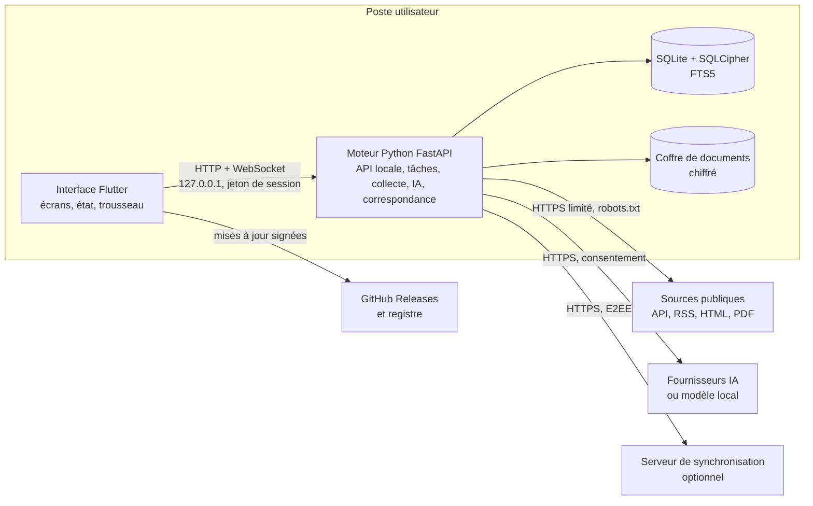
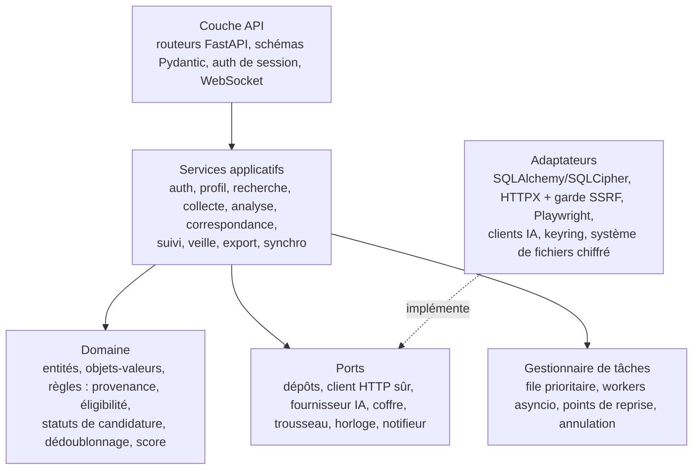
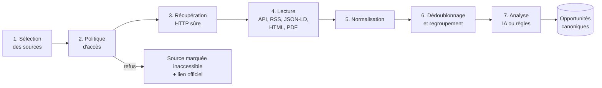
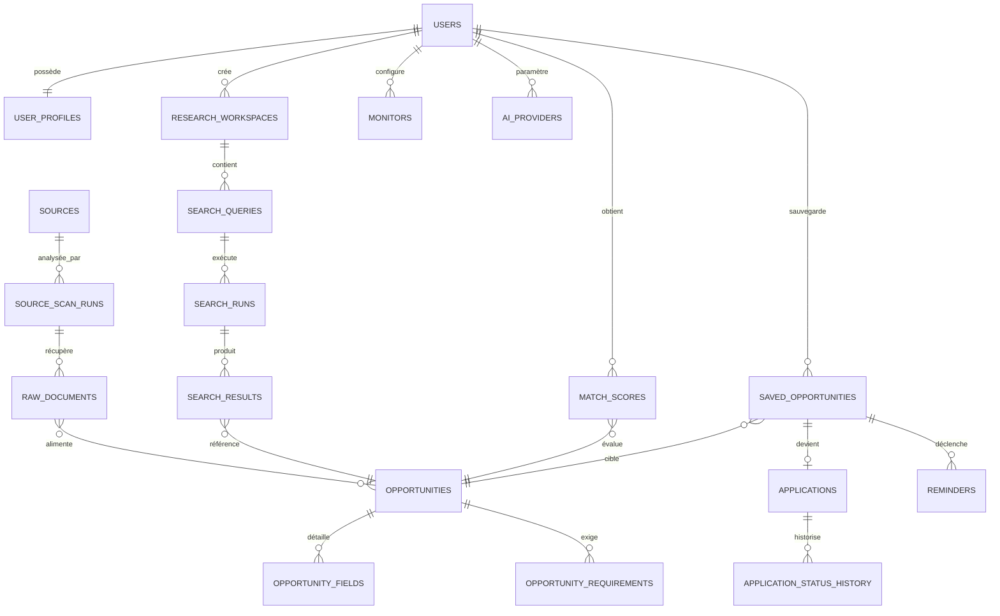
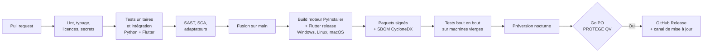

# Document technique d'architecture — PIO

Oct 2, 2026 · @momo godi yvan

## 1. Vue d'ensemble et décisions d'architecture

La PIO est une application locale d'abord composée de deux processus sur le poste : une interface Flutter et un moteur Python FastAPI qui écoute uniquement sur 127.0.0.1. Les données vivent dans une base SQLite chiffrée ; un serveur de synchronisation optionnel et auto-hébergeable ne voit que des blocs chiffrés. Ce document accompagne le cahier des charges et le fichier de schéma SQL ; il est rédigé en prose, sans code, pour guider les équipes et les agents de développement.

### 1.1 Décisions d'architecture (ADR)

| ADR | Décision | Motif | Alternative écartée |
| --- | --- | --- | --- |
| ADR-001 | Deux processus : Flutter pour l'interface, Python pour le moteur, reliés par HTTP/WebSocket local | L'écosystème Python est sans équivalent pour la collecte, l'analyse documentaire et l'IA ; Flutter offre une interface native performante | Tout en Dart (bibliothèques de collecte et d'IA trop limitées) ; Electron (consommation mémoire) |
| ADR-002 | Le moteur est lancé et supervisé par l'interface, port aléatoire, jeton de 256 bits passé par canal standard à l'initialisation | Aucune exposition réseau, un seul programme pour l'utilisateur | Port fixe (collision, attaques locales) |
| ADR-003 | SQLite en mode WAL, chiffré par SQLCipher 4, FTS5 pour la recherche | Local d'abord, zéro administration, recherche plein texte intégrée | PostgreSQL embarqué (lourd) |
| ADR-004 | Identifiants UUID v7 sur les entités synchronisables | Triables dans le temps, générables hors ligne sans collision | Entiers auto-incrémentés (conflits entre appareils) |
| ADR-005 | Séparation des données partagées (sources, opportunités) et des données propres à l'utilisateur (scores, sauvegardes, candidatures) | Une opportunité dédoublonnée sert plusieurs profils sans fuite entre eux | Copie des opportunités par utilisateur (doublons, volumétrie) |
| ADR-006 | Adaptateurs de sources déclaratifs (JSON signé), sans code arbitraire | Sécurité des contributions communautaires, revue facile | Plugins Python libres (exécution de code non fiable) |
| ADR-007 | Ordre d'accès : API, RSS/Atom, données structurées, HTML statique, navigateur sans tête | Charge minimale sur les sites, fiabilité, légalité | Navigateur sans tête systématique |
| ADR-008 | Passerelle IA indépendante du fournisseur, sorties validées par schéma, cache par empreinte, repli déterministe | IA optionnelle et remplaçable, quotas variables | Dépendance à un fournisseur unique |
| ADR-009 | Dédoublonnage avant toute analyse IA | Économie de quota et de temps | Analyse puis dédoublonnage |
| ADR-010 | Score de correspondance déterministe et explicable ; l'IA ne produit que le texte d'explication | Transparence et reproductibilité | Score produit par un modèle de langage |
| ADR-011 | Secrets dans le trousseau natif du système, jamais en base | Protection contre la lecture de fichiers | Fichier .env local |
| ADR-012 | Synchronisation par journal d'opérations chiffré de bout en bout et horloge de Lamport | Le serveur ne lit rien ; fonctionnement hors ligne | Base partagée en clair côté serveur |
| ADR-013 | Gestion d'état Flutter avec Riverpod, navigation go\_router | Testabilité, découplage | BLoC (verbeux pour une petite équipe) |
| ADR-014 | Licence AGPL v3 | Garantir le caractère libre même pour le service réseau | MIT (appropriation possible) |

## 2. Pile technique

Toutes les briques retenues sont libres et compatibles avec l'AGPL v3. Les versions indiquées sont des planchers ; la version exacte est figée dans les fichiers de verrouillage et revérifiée au sprint 0, tout comme les conditions d'usage des API d'IA et de recherche, qui évoluent souvent.

### 2.1 Interface Flutter

| Besoin | Choix | Licence |
| --- | --- | --- |
| Framework | Flutter 3.24+ / Dart 3.5+, cibles bureau Windows, Linux, macOS | BSD-3 |
| Gestion d'état | Riverpod 2 avec génération de code | MIT |
| Navigation | go\_router | BSD-3 |
| Client HTTP et WebSocket | dio, web\_socket\_channel | MIT, BSD-3 |
| Modèles immuables | freezed, json\_serializable | MIT, BSD-3 |
| Internationalisation | flutter\_localizations, intl, fichiers ARB | BSD-3 |
| Trousseau sécurisé | flutter\_secure\_storage | BSD-3 |
| Notifications natives | local\_notifier ou flutter\_local\_notifications | MIT, BSD-3 |
| Fenêtre et zone de notification | window\_manager, tray\_manager | MIT |
| Graphiques du tableau de bord | fl\_chart | MIT |
| Rendu Markdown | flutter\_markdown | BSD-3 |
| Ouverture de liens | url\_launcher | BSD-3 |
| Tests | flutter\_test, integration\_test, mocktail, golden tests | BSD-3, MIT |

### 2.2 Moteur Python

| Besoin | Choix | Licence |
| --- | --- | --- |
| Langage | Python 3.12 | PSF |
| API locale | FastAPI, Uvicorn, Pydantic v2 | MIT, BSD-3 |
| ORM et migrations | SQLAlchemy 2 (mode asynchrone avec aiosqlite), Alembic | MIT |
| Chiffrement de la base | SQLCipher via sqlcipher3 | BSD |
| HTTP | HTTPX (HTTP/2, pool de connexions) | BSD-3 |
| Analyse HTML | selectolax (rapide), Beautiful Soup en secours, lxml | MIT |
| Extraction de contenu principal | trafilatura | Apache 2.0 |
| Flux | feedparser | BSD-2 |
| Données structurées | extruct (JSON-LD, microdata) | BSD-3 |
| Navigateur sans tête | Playwright (Chromium téléchargé à la demande) | Apache 2.0 |
| robots.txt | Protego | BSD-3 |
| PDF et DOCX | pypdf, pdfplumber, python-docx | BSD-3, MIT |
| Dates et langues | dateparser, langdetect / lingua | BSD-3, Apache 2.0 |
| Similarité | rapidfuzz, simhash maison | MIT |
| Normalisation d'URL | url-normalize avec liste des paramètres de suivi | MIT |
| Planification | APScheduler 3 avec persistance SQLite | MIT |
| Hachage et cryptographie | argon2-cffi, cryptography, PyNaCl | MIT, Apache/BSD |
| Trousseau | keyring | MIT |
| Clients IA | client HTTP générique compatible OpenAI + adaptateurs Gemini, Anthropic, Ollama | — |
| Embeddings locaux | fastembed (modèles ONNX légers), optionnel | Apache 2.0 |
| Exports | openpyxl, WeasyPrint ou ReportLab, csv standard | MIT, BSD |
| Journaux | structlog (JSON) | MIT/Apache |
| Qualité | Ruff, mypy strict, pytest, pytest-asyncio, respx, hypothesis, coverage | MIT |
| Empaquetage | PyInstaller (binaire unique par plateforme) | GPL avec exception |

### 2.3 Serveur de synchronisation

| Besoin | Choix |
| --- | --- |
| API | FastAPI, Uvicorn derrière Caddy (TLS automatique) |
| Stockage | PostgreSQL 16 (blobs chiffrés, métadonnées minimales) |
| Déploiement | Image Docker et fichier Compose documenté |
| Courriel transactionnel | SMTP configurable (vérification, réinitialisation) |

### 2.4 Outillage du projet

GitHub (dépôt public, Projects, Actions, Releases, Pages), MkDocs Material, Weblate, PlantUML et Mermaid, Dependabot, CodeQL, Gitleaks, pip-audit, OSV-Scanner, signature Sigstore.

## 3. Architecture de l'application Flutter

L'interface suit une architecture propre en trois couches, organisée par fonctionnalité : chaque module métier possède sa présentation, sa logique d'application et son accès aux données. L'interface ne contient aucune règle métier critique ; elle affiche, valide les saisies et délègue au moteur.

### 3.1 Couches

| Couche | Contenu | Règles |
| --- | --- | --- |
| Présentation | Écrans, widgets, thèmes, formulaires | Aucun appel réseau direct ; lit l'état exposé par les contrôleurs |
| Application | Contrôleurs Riverpod (notifiers asynchrones), cas d'usage, validation de formulaires | Ne dépend que d'interfaces de dépôts |
| Données | Client de l'API locale, flux WebSocket, modèles immuables, trousseau | Traduit les erreurs techniques en erreurs métier typées |
| Socle | Superviseur du moteur, configuration, journalisation, internationalisation, design system | Partagé par tous les modules |

### 3.2 Modules fonctionnels

auth, onboarding, profile, cv\_import, search, results, opportunity\_detail, application\_assistant, saved, applications (Kanban, calendrier), monitors, sources, workspaces, dashboard, exports, ai\_settings, organizations, sync, notifications, settings, privacy. Chaque module correspond à un module M01 à M18 du cahier des charges.

### 3.3 Structure de navigation

- Hors session : écran de démarrage (lancement du moteur), connexion, inscription, récupération par phrase, choix du profil local.
- Première connexion : assistant d'onboarding en 7 étapes, puis visite guidée.
- En session : coque principale avec barre latérale rétractable (Tableau de bord, Recherche, Résultats, Sauvegardes, Candidatures, Veilles, Espaces, Sources, Organisations), barre supérieure avec recherche globale en langage naturel, centre de notifications et menu du compte.
- Paramètres : Compte et sécurité, Profil, IA, Confidentialité, Notifications, Apparence et langue, Réseau, Sauvegardes, Synchronisation, À propos (auteur, financeur, licence).
- Raccourcis : palette de commandes, Ctrl+K pour la recherche, Ctrl+S pour sauvegarder l'opportunité ouverte, Échap pour fermer un panneau.

### 3.4 Supervision du moteur

1. Au lancement, l'interface génère un jeton de session aléatoire et démarre le binaire du moteur en lui transmettant le jeton par son entrée standard.
2. Le moteur choisit un port libre sur 127.0.0.1 et l'annonce sur sa sortie standard.
3. L'interface interroge l'endpoint de santé jusqu'à disponibilité (10 s maximum), puis ouvre le canal WebSocket d'événements.
4. En cas d'arrêt inattendu, l'interface relance le moteur jusqu'à 3 fois avec recul exponentiel, puis affiche un écran de diagnostic avec export des journaux expurgés.
5. À la fermeture, l'interface demande un arrêt propre : le moteur persiste l'état des tâches en cours pour reprise.

### 3.5 Design system

- Jetons de couleur, typographie, espacements et rayons définis une seule fois, déclinés en thèmes clair et sombre conformes WCAG 2.2 AA.
- Badges sémantiques uniformes : Vérifié, Déduit, Généré par IA, Non précisé, Expiré, Échéance proche, Éligibilité incertaine. Une couleur n'est jamais le seul porteur de sens : chaque badge a une icône et un libellé.
- Composants partagés : carte d'opportunité, jauge de score avec décomposition, tableau paginé virtualisé, panneau de filtres, états vide, chargement et erreur standardisés, bandeau de progression de tâche.
- Listes longues virtualisées et pagination incrémentale par curseur.

## 4. Architecture du moteur Python

Le moteur applique une architecture hexagonale : le domaine ne dépend d'aucune bibliothèque externe, les services orchestrent les cas d'usage, et les adaptateurs (HTTP, SQLite, IA, trousseau, système de fichiers) sont interchangeables derrière des ports. Cette séparation permet de tester toute la logique métier sans réseau ni base réelle.

### 4.1 Paquets du moteur

| Paquet | Responsabilité |
| --- | --- |
| api | Routeurs par module, dépendances (session, utilisateur courant), gestion uniforme des erreurs au format RFC 9457 (Problem Details) |
| domain | Entités et règles pures : Opportunity, ProvenancedField, MatchScore, ApplicationStatus (automate d'états), DedupKey |
| services | Cas d'usage, transactions, publication d'événements internes |
| collection | Planificateur de collecte, politique d'accès (robots, délais), client HTTP sûr, lecteurs (API, RSS, sitemap, JSON-LD, HTML, PDF, navigateur), moteur d'adaptateurs |
| extraction | Normalisation (dates, devises, pays, langues), nettoyage HTML, extraction déterministe |
| dedup | Normalisation d'URL, empreintes, simhash, regroupement multi-sources |
| ai | Passerelle, registre de fournisseurs, gabarits de prompts versionnés, validation de schémas, cache, comptabilité d'usage |
| matching | Calcul du score, explication structurée, apprentissage local des retours |
| tracking | Sauvegardes, candidatures, listes de pièces, rappels |
| documents | Assistant de candidature, versionnement, contrôle d'intégrité des affirmations |
| monitoring | Veilles planifiées, détection de nouveautés et de modifications, balayage d'expiration |
| exports | CSV, XLSX, PDF, JSON, iCalendar, archive de portabilité |
| security | Dérivation de clés, chiffrement du coffre, expurgation des journaux, journal des événements de sécurité |
| sync | Boîte d'envoi, chiffrement E2EE, résolution de conflits |
| persistence | Modèles SQLAlchemy, dépôts, migrations Alembic, sauvegarde et restauration |

### 4.2 Tâches de fond

- Toute opération de plus de 500 ms est une tâche enregistrée dans la table background\_jobs : recherche, collecte, analyse, import de CV, export, sauvegarde, synchronisation.
- Une file prioritaire en mémoire, adossée à la table, alimente un pool de workers asyncio ; les traitements lourds (analyse PDF, génération PDF) passent par un pool de processus isolés avec limites de mémoire et de durée.
- Chaque tâche écrit un point de reprise (checkpoint JSON) après chaque étape ; au redémarrage, les tâches « running » sans battement de cœur récent sont reprises depuis leur dernier point.
- L'annulation est coopérative : drapeau cancel\_requested vérifié entre deux unités de travail.
- La progression est diffusée par WebSocket sous forme d'événements typés : job.progress, job.source\_status, job.completed, job.failed.

### 4.3 Concurrence et limites

- 8 requêtes HTTP simultanées au total, 1 par domaine, délai minimal de 2 s par domaine (ou Crawl-delay s'il est supérieur).
- 2 appels IA simultanés par fournisseur par défaut, ajustables selon le quota.
- Une seule écriture SQLite à la fois via une file d'écriture ; lectures concurrentes grâce au mode WAL.

### 4.4 Cycle de vie d'une requête API

1. Vérification du jeton de session dans l'en-tête d'autorisation et de l'origine locale.
2. Validation du corps par schéma Pydantic strict.
3. Résolution de l'utilisateur courant ; toute requête de dépôt est filtrée par son identifiant.
4. Exécution du service dans une transaction ; réponse immédiate 202 avec identifiant de tâche pour les traitements longs.
5. Journalisation structurée expurgée avec identifiant de corrélation.

## 5. Contrat d'API locale

L'API locale est versionnée sous le préfixe /api/v1, décrite par un schéma OpenAPI 3.1 généré automatiquement, d'où l'on dérive le client Dart typé. Toutes les routes, sauf la santé et l'authentification initiale, exigent le jeton de session du processus et une session utilisateur ouverte.

### 5.1 Conventions

- JSON en UTF-8, dates ISO 8601 en UTC, montants en unité mineure avec code devise.
- Pagination par curseur opaque (paramètres cursor et limit, 50 par défaut, 200 maximum).
- Erreurs au format Problem Details avec un code métier stable (exemples : AUTH\_LOCKED, SOURCE\_DISALLOWED, AI\_QUOTA\_EXHAUSTED, SCHEMA\_INVALID).
- Traitements longs : réponse 202 avec identifiant de tâche, suivi par WebSocket et par l'endpoint des tâches.
- Idempotence des créations par en-tête Idempotency-Key.

### 5.2 Endpoints REST par domaine

| Domaine | Endpoints principaux |
| --- | --- |
| Système | GET /health · GET /version · POST /shutdown |
| Authentification | POST /auth/register · POST /auth/login · POST /auth/logout · POST /auth/lock · POST /auth/unlock · POST /auth/recover · PUT /auth/password · DELETE /auth/account · GET /auth/local-profiles |
| Profil | GET, PUT /profile · CRUD /profile/education, /profile/experiences, /profile/certifications · PUT /profile/skills · PUT /profile/languages · PUT /profile/objectives · CRUD /profile/projects · GET /profile/completeness · POST /profile/summary:generate · PUT /profile/summary |
| Import de CV | POST /cv-imports · GET /cv-imports/{id} · PATCH /cv-imports/{id}/items/{itemId} · POST /cv-imports/{id}:apply |
| Référentiels | GET /ref/countries · /ref/currencies · /ref/languages · /ref/categories · /ref/objectives · GET /ref/skills?q= |
| Recherche | POST /searches:interpret · POST /searches (lance une exécution) · GET /searches · GET /searches/{id} · POST /searches/{id}:rerun · GET /search-runs/{id} · GET /search-runs/{id}/results · GET /search-runs/{a}/diff/{b} · POST /search-runs/{id}:cancel |
| Opportunités | GET /opportunities (filtres, tri, plein texte) · GET /opportunities/{id} · GET /opportunities/{id}/fields · GET /opportunities/{id}/sources · POST /opportunities/{id}:recheck · GET /opportunities/{id}/match · POST /opportunities/{id}/feedback · GET /opportunities:compare?ids= |
| Sources | CRUD /sources · POST /sources:discover (analyse d'une URL) · POST /sources/{id}:test · GET /sources/{id}/scan-runs · CRUD /sources/{id}/adapters · GET /registry/connectors · POST /registry/connectors/{id}:install |
| Sauvegardes et candidatures | CRUD /saved · CRUD /saved/{id}/notes · CRUD /saved/{id}/checklist · CRUD /saved/{id}/documents · GET, PUT /applications/{id} · PATCH /applications/{id}/status · CRUD /applications/{id}/events · GET /applications/board · GET /calendar |
| Assistant | POST /saved/{id}/generated-documents · GET /generated-documents/{id} · PUT /generated-documents/{id} (nouvelle version) · GET /generated-documents/{id}/versions |
| Rappels et notifications | CRUD /reminders · GET /notifications · POST /notifications/{id}:read · PUT /notification-preferences |
| Veilles | CRUD /monitors · POST /monitors/{id}:run · GET /monitors/{id}/runs |
| Espaces | CRUD /workspaces · CRUD /workspaces/{id}/notes · POST, DELETE /workspaces/{id}/opportunities/{oppId} |
| Tableau de bord | GET /dashboard · GET /dashboard/stats |
| IA | CRUD /ai/providers · POST /ai/providers/{id}:test · PUT /ai/routing · GET /ai/usage |
| Exports | POST /exports · GET /exports/{id} · POST /imports |
| Confidentialité | GET /privacy/overview · GET, POST, DELETE /privacy/consents · GET /privacy/disclosures · POST /privacy/erase |
| Organisations | CRUD /organizations · CRUD /organizations/{id}/members · POST /organizations/{id}/invitations · GET /organizations/{id}/audit |
| Synchronisation | GET /sync/status · POST /sync/link · POST /sync:now · GET /sync/conflicts · POST /sync/conflicts/{id}:resolve · CRUD /sync/devices |
| Maintenance | GET /jobs · GET /jobs/{id} · POST /jobs/{id}:cancel · POST /backups · GET /backups · POST /backups/{id}:restore · GET /logs:export · CRUD /settings |

### 5.3 Canal WebSocket /api/v1/events

Un seul canal par session transporte des événements typés, chacun avec un identifiant, un type, un horodatage et une charge utile :

| Type d'événement | Usage |
| --- | --- |
| job.progress, job.source\_status, job.completed, job.failed | Progression des recherches, veilles, exports |
| opportunity.created, opportunity.changed, opportunity.expired | Mise à jour des listes ouvertes |
| reminder.due, notification.created | Centre de notifications et notifications natives |
| source.health\_changed | État des sources |
| sync.state\_changed, sync.conflict | Synchronisation |
| session.locked | Verrouillage automatique |

L'interface se réabonne après une coupure et rattrape les événements manqués par l'identifiant du dernier événement reçu.

## 6. Pipeline de collecte et de dédoublonnage

La collecte transforme une requête validée en opportunités canoniques en sept étapes ; le dédoublonnage intervient avant toute analyse IA, et chaque étape écrit son résultat en base pour permettre la reprise.

### 6.1 Étapes

1. **Sélection des sources** : correspondance entre les filtres (catégorie, pays, langue) et les catégories déclarées des sources actives, tri par fiabilité et caractère officiel, plafond paramétrable par recherche.
2. **Politique d'accès** : liste d'exclusion des éditeurs, robots.txt mis en cache 24 h, intervalle minimal entre deux analyses, statut d'autorisation de la source. Tout refus est explicite et tracé.
3. **Récupération sûre** : client HTTPX avec garde SSRF, User-Agent déclaré, en-têtes conditionnels (ETag, Last-Modified), délai d'expiration de 30 s, taille maximale de 10 Mo, 5 redirections, 3 tentatives sur erreurs 429, 502, 503, 504 avec recul exponentiel et respect de Retry-After.
4. **Lecture** selon la méthode d'accès : client d'API déclaré dans l'adaptateur, flux RSS/Atom, extraction JSON-LD schema.org (JobPosting, Grant, EducationalOccupationalProgram, Event), adaptateur HTML déclaratif, extraction de texte PDF, navigateur sans tête en dernier recours et seulement si l'adaptateur le déclare.
5. **Normalisation** : dates (dateparser, fuseau de la source), devises ISO 4217 avec conversion indicative datée en XAF, pays ISO 3166, langue détectée, HTML assaini en texte. Les libellés de date limite et d'éligibilité sont conservés mot pour mot.
6. **Dédoublonnage et regroupement** (section 6.3).
7. **Analyse** des seules opportunités nouvelles ou modifiées (section 7).

### 6.2 Adaptateurs déclaratifs

Un adaptateur est un document JSON signé, validé par un schéma publié, qui décrit sans code exécutable :

- l'identité de la source : nom, domaine, éditeur, type, pays, langue, catégories ;
- la méthode d'accès et ses paramètres : URL de liste, URL de flux, paramètres de requête autorisés, gabarit de recherche ;
- la liste : sélecteur des éléments, sélecteur du lien vers le détail, règle de pagination et nombre maximal de pages ;
- le détail : sélecteurs CSS ou XPath par champ (titre, organisme, lieu, date limite, montant, éligibilité, lien de candidature), formats de date attendus, transformations simples autorisées (extraction par expression régulière bornée, découpage, nettoyage) ;
- les contraintes : intervalle minimal, besoin de navigateur, conditions d'utilisation consultées et date de vérification ;
- les jeux de test : captures HTML de référence et résultats attendus, exécutés en intégration continue pour détecter les changements de structure.

L'éditeur visuel de l'application produit ce même format à partir d'un clic sur les éléments d'une page affichée en lecture seule.

### 6.3 Algorithme de dédoublonnage

Quatre niveaux successifs, du plus sûr au plus approximatif :

| Niveau | Clé | Décision |
| --- | --- | --- |
| 1 | URL normalisée (schéma et hôte en minuscules, suppression de www, des fragments, des paramètres de suivi utm, fbclid, gclid, ref ; tri des paramètres restants) | Identique = même opportunité |
| 2 | Identifiant natif de la source (external\_id) | Identique dans la même source = même opportunité |
| 3 | Empreinte SHA-256 de titre normalisé + organisme normalisé + date limite | Identique = même opportunité, multi-sources |
| 4 | Simhash 64 bits du titre et du début de description, distance de Hamming ≤ 3, confirmée par similarité de titre ≥ 0,90 et organisme compatible | Candidat doublon, regroupé avec trace de la méthode |

Lors du regroupement, l'occurrence publiée par l'éditeur officiel devient la source principale ; à défaut, celle de la source la plus fiable. Toutes les occurrences restent consultables dans la fiche.

### 6.4 Détection de modification et d'expiration

- Une revérification compare l'empreinte du contenu ; en cas de différence, les champs modifiés sont historisés et l'opportunité passe à « Modifiée » puis est réanalysée.
- Une réponse 404 ou 410 répétée deux fois à 24 h d'intervalle fait passer l'opportunité à « Retirée ».
- Un balayage quotidien marque « Expirée » toute opportunité dont la date limite est dépassée et met à jour les candidatures non soumises correspondantes.

## 7. Passerelle IA et moteur de correspondance

L'IA structure et explique, elle ne décide pas : le score est calculé par un algorithme déterministe et chaque valeur extraite porte sa provenance. Sans fournisseur configuré, la même chaîne fonctionne avec l'extraction par adaptateurs et par règles.

### 7.1 Passerelle IA

- **Registre de fournisseurs** : un adaptateur par famille (API compatible OpenAI couvrant Mistral, Groq, OpenRouter et les serveurs locaux ; Gemini ; Anthropic ; Ollama ; LM Studio). Chaque adaptateur déclare ses capacités : sortie JSON structurée, taille de contexte, embeddings.
- **Routage par tâche** : interprétation de requête, extraction, classification, résumé, explication de correspondance, analyse de CV, rédaction, traduction, embeddings. Chaque tâche peut viser un modèle différent.
- **Chaîne de repli** : ordre de fournisseurs défini par l'utilisateur ; en dernier recours, voie déterministe.
- **Gestion des quotas** : plafond quotidien par fournisseur, respect des en-têtes de limite, suspension temporaire après erreur 429, comptabilité dans ai\_usage\_logs.
- **Cache** : clé = empreinte de la tâche, de la version du gabarit, du modèle et du contenu ; une opportunité inchangée n'est jamais réanalysée.
- **Minimisation** : le profil envoyé est anonymisé (aucun nom, contact ni lien) ; seul le texte nécessaire de l'annonce est transmis, tronqué au budget de jetons de la tâche.

### 7.2 Gabarits de prompts et défense contre l'injection

1. Gabarits versionnés dans le dépôt, testés par jeux d'évaluation, identifiés par une version stockée avec chaque résultat.
2. Instructions système fixes ; le contenu collecté est placé dans un bloc de données délimité et explicitement désigné comme non fiable.
3. Le modèle n'a accès à aucun outil ni action : il ne peut que renvoyer un objet JSON.
4. Sortie validée par un schéma Pydantic strict ; un échec déclenche une seule nouvelle tentative avec le message d'erreur, puis la voie déterministe.
5. Contrôles déterministes a posteriori : une date limite doit apparaître dans le texte source sous une forme reconnaissable, un montant doit figurer dans l'extrait cité, une URL de candidature doit appartenir au domaine de la source ou être présente dans le texte. Toute valeur non justifiée est rétrogradée en « Non vérifiable ».
6. Les motifs d'injection détectés sont journalisés dans security\_events.

### 7.3 Provenance des champs

| Provenance | Signification | Affichage |
| --- | --- | --- |
| explicit | Valeur présente mot pour mot ou quasi mot pour mot dans la source, extrait conservé | Badge « Vérifié » + extrait au survol |
| inferred | Déduite du contenu (ex. niveau requis déduit de « étudiants en master ») | Badge « Déduit » + extrait justificatif |
| generated | Résumé, explication, recommandation | Badge « Généré par IA » |
| not\_specified | Absente de la source | « Non précisé » |
| unverifiable | Proposée mais non justifiée par la source | « Non vérifiable » |

### 7.4 Algorithme de correspondance

Le score est une somme pondérée de sept sous-scores compris entre 0 et 1, multipliée par 100. Les pondérations par défaut sont modifiables dans les paramètres et stockées dans la table matching\_weights.

| Critère | Poids | Calcul du sous-score |
| --- | --- | --- |
| Compétences | 30 % | Part des compétences requises couvertes par le profil (après résolution des alias), les obligatoires comptant double ; similarité sémantique en complément si les embeddings sont actifs |
| Formation | 15 % | 1 si le niveau du profil atteint le niveau requis, 0,5 un niveau en dessous, 0 au-delà ; bonus de domaine d'études |
| Expérience | 15 % | 1 dans la fourchette requise, décroissance linéaire en dessous du minimum, légère pénalité en cas de surqualification marquée |
| Localisation | 15 % | 1 si pays ou région éligible correspond aux préférences, ou si télétravail accepté des deux côtés ; 0,5 si mobilité déclarée ; 0 sinon |
| Langues | 10 % | Part des langues requises maîtrisées au niveau demandé (CECRL) |
| Objectifs | 10 % | 1 si la catégorie correspond à un objectif déclaré, pondéré par sa priorité |
| Délai | 5 % | 1 si la date limite laisse au moins 14 jours, décroissance jusqu'à 0 à la date limite |

Règles complémentaires :

- Un critère dont l'exigence n'est pas précisée par l'annonce est neutralisé et son poids redistribué proportionnellement ; il apparaît dans l'explication comme « non évalué ».
- Une exigence bloquante non satisfaite (nationalité, résidence, âge, statut juridique) plafonne le score à 30 et classe l'éligibilité en « peu probable » ; si l'information manque dans le profil, l'éligibilité reste « incertaine » et la condition est listée à vérifier.
- L'éligibilité « probable » n'est attribuée que si toutes les exigences publiées sont confrontées à une donnée du profil et satisfaites.
- Les retours de l'utilisateur ajustent localement, par catégorie et par source, un léger terme de préférence (± 5 points maximum), sans jamais modifier les critères d'éligibilité.
- Le score est recalculé si le profil change (empreinte de profil) ou si l'opportunité est modifiée.

### 7.5 Assistant de candidature

- Entrées : profil validé par l'utilisateur, champs explicites de l'opportunité, gabarit du type de document.
- Contrôle d'intégrité : après génération, chaque diplôme, employeur, durée, certification ou distinction mentionné est rapproché du profil ; toute affirmation absente est signalée dans integrity\_flags et surlignée pour correction.
- Chaque modification de l'utilisateur crée une nouvelle version ; l'export se fait en DOCX ou PDF.

## 8. Modèle de données

Le schéma SQLite compte 85 tables réparties en 14 domaines, plus un index plein texte FTS5, 72 index, 12 déclencheurs et 3 vues. Il a été exécuté et contrôlé (intégrité, clés étrangères, déclencheurs, recherche plein texte) sur SQLite 3.45. Le script complet est livré dans le fichier pio\_schema.sql.

### 8.1 Domaines et tables

| Domaine | Tables | Nombre |
| --- | --- | --- |
| Métadonnées | alembic\_version, application\_settings | 2 |
| Référentiels | countries, currencies, exchange\_rates, languages, opportunity\_categories, objectives, skills, skill\_aliases | 8 |
| Identité et consentements | users, user\_sessions, login\_attempts, consents, data\_disclosures | 5 |
| Profil | user\_profiles, profile\_preferred\_locations, education\_records, certifications, work\_experiences, user\_skills, user\_languages, profile\_links, user\_objectives, user\_custom\_objectives, project\_profiles, cv\_imports, cv\_extracted\_items | 13 |
| Organisations | organizations, organization\_members, organization\_invitations | 3 |
| Sources et collecte | sources, source\_categories, source\_adapters, robots\_cache, domain\_exclusions, source\_scan\_runs, http\_cache, raw\_documents | 8 |
| Opportunités | opportunities, opportunity\_sources, opportunity\_fields, opportunity\_requirements, opportunity\_versions, opportunity\_embeddings (+ opportunities\_fts) | 6 |
| Recherche et espaces | research\_workspaces, search\_queries, search\_runs, search\_run\_sources, search\_results, workspace\_opportunities, workspace\_notes | 7 |
| Correspondance | matching\_weights, match\_scores, match\_feedback | 3 |
| Suivi des candidatures | saved\_opportunities, tags, saved\_opportunity\_tags, applications, application\_status\_history, application\_events, application\_notes, checklist\_items, application\_documents, generated\_documents, generated\_document\_versions, reminders | 12 |
| Veille et notifications | monitors, monitor\_sources, monitor\_runs, notification\_records, notification\_preferences | 5 |
| IA et sécurité | ai\_providers, ai\_task\_routing, ai\_usage\_logs, ai\_cache, security\_events | 5 |
| Tâches, exports, sauvegardes | background\_jobs, export\_records, backup\_records | 3 |
| Synchronisation et audit | sync\_devices, sync\_state, sync\_outbox, sync\_conflicts, audit\_logs | 5 |

### 8.2 Entités centrales

### 8.3 Règles d'intégrité notables

- Tables déclarées STRICT : typage vérifié par SQLite à chaque écriture.
- Clés étrangères activées ; suppression en cascade pour les données propres à un utilisateur, mise à NULL pour les références de traçabilité (tâche, fournisseur IA), restriction pour les référentiels.
- Contraintes CHECK sur toutes les énumérations (statuts, provenance, rôles), les fourchettes (montant maximum supérieur ou égal au minimum, dates de fin postérieures au début) et les JSON (json\_valid).
- Une candidature au statut « Soumise » exige une date de soumission : l'application ne peut pas déclarer une soumission sans action de l'utilisateur.
- Un montant ne peut exister sans devise ; les montants sont stockés en unité mineure (le franc CFA n'a pas de subdivision).
- Un délai minimal de 2 s par domaine et un intervalle minimal de 60 minutes entre analyses sont imposés au niveau de la table sources.
- Une seule version active d'adaptateur par source (index unique partiel).
- Aucune colonne ne contient de clé d'API : ai\_providers ne stocke qu'une référence au trousseau.

### 8.4 Déclencheurs et vues

| Objet | Rôle |
| --- | --- |
| trg\_opp\_fts\_ai, \_ad, \_au | Maintiennent l'index plein texte (accents ignorés) |
| trg\_application\_initial\_status, trg\_application\_status\_history | Historisent chaque changement de statut |
| trg\_application\_owner\_check | Empêche une candidature rattachée à la sauvegarde d'un autre utilisateur |
| trg\_source\_exclusion\_guard | Interdit de réactiver une source exclue à la demande de son éditeur |
| trg\_scan\_run\_finish | Met à jour l'état de santé et le compteur d'échecs de la source |
| trg\_\*\_updated | Horodatent les mises à jour |
| v\_upcoming\_deadlines | Échéances effectives (personnelle ou officielle) et jours restants |
| v\_dashboard\_counters | Compteurs du tableau de bord, calculés sur les données réelles |
| v\_source\_health | Santé et volumétrie par source |

### 8.5 Migrations et évolution

- Alembic gère les révisions ; la révision 0001\_baseline correspond au fichier livré.
- Chaque migration est réversible, testée sur une base de référence remplie, et précédée d'une sauvegarde automatique de type pre\_migration.
- Les modifications de colonnes passent par le mode batch d'Alembic (recréation de table), indispensable sous SQLite.
- La version du schéma est portée par user\_version et par application\_settings ; l'application refuse d'ouvrir une base plus récente que son code.

### 8.6 Volumétrie de dimensionnement

Hypothèse haute pour un utilisateur très actif sur 2 ans : 100 000 opportunités, 300 000 documents bruts, 2 000 recherches, 500 sauvegardes. Les index composites (catégorie et date limite, utilisateur et score, statut et échéance) maintiennent les requêtes de liste sous 100 ms ; une purge paramétrable supprime les documents bruts et le cache HTTP de plus de 90 jours non rattachés à une sauvegarde.

## 9. Architecture de sécurité et modèle de menaces

La sécurité repose sur quatre barrières : aucune exposition réseau du moteur, chiffrement des données au repos, contenu externe traité comme hostile, et secrets confiés au système d'exploitation. Le modèle de menaces suit la méthode STRIDE et est revu à chaque version majeure.

### 9.1 Gestion des clés

1. À l'inscription, une clé de données aléatoire de 256 bits est générée ; elle chiffre la base (SQLCipher) et le coffre de documents.
2. Cette clé est enveloppée deux fois : par une clé dérivée du mot de passe (Argon2id, 64 Mo, 3 itérations) et par une clé dérivée de la phrase de récupération de 12 mots.
3. Le changement de mot de passe ne réenveloppe que la clé, sans rechiffrer la base.
4. Le hachage d'authentification (Argon2id) est distinct de la dérivation de clé (sel différent).
5. Au verrouillage, la clé est effacée de la mémoire du moteur et la base est fermée.

### 9.2 Modèle de menaces STRIDE

| Menace | Scénario | Contre-mesure |
| --- | --- | --- |
| Usurpation | Un autre programme local appelle l'API du moteur | Écoute sur 127.0.0.1 uniquement, port aléatoire, jeton de processus de 256 bits, refus des en-têtes Origin de navigateur |
| Usurpation | Faux connecteur ou fausse mise à jour | Signatures vérifiées (Sigstore, minisign), clés publiques embarquées |
| Altération | Modification de la base hors application | Chiffrement authentifié SQLCipher (HMAC par page), contrôle d'intégrité au démarrage |
| Altération | Page collectée qui manipule l'IA (injection de prompt) | Isolation instructions/données, schéma strict, aucun outil, contrôles déterministes, journalisation |
| Répudiation | Contestation d'un changement dans une organisation | Journal d'audit signé côté serveur de synchronisation |
| Divulgation | Vol de l'ordinateur | Base et coffre chiffrés, verrouillage automatique, secrets dans le trousseau |
| Divulgation | Fuite vers un fournisseur d'IA | Consentement explicite, anonymisation, journal des envois, modèles locaux proposés |
| Divulgation | Journaux contenant des données personnelles | Expurgation automatique, niveau de détail limité par défaut |
| Divulgation | Serveur de synchronisation compromis | Chiffrement de bout en bout, aucune clé côté serveur, métadonnées minimales |
| Déni de service | Page géante, boucle de redirection, PDF piégé | Limites de taille, de durée et de redirections ; analyse en processus isolé avec plafond mémoire |
| Élévation de privilèges | SSRF vers le réseau local ou les métadonnées cloud | Garde SSRF (section 9.3) |
| Élévation de privilèges | Traversée de chemins via un nom de fichier | Noms de fichiers du coffre générés (UUID), chemins canonicalisés et confinés |

### 9.3 Garde SSRF du client HTTP

- Schémas autorisés : http et https uniquement ; ports 80, 443 et ports explicitement déclarés par un adaptateur signé.
- Résolution DNS effectuée par le client ; refus de toute adresse de bouclage, privée (RFC 1918, ULA IPv6), link-local, multicast, réservée, et des adresses de métadonnées cloud.
- Connexion forcée à l'adresse validée pour empêcher le rebinding DNS ; nouvelle validation à chaque redirection.
- Exception unique : les fournisseurs d'IA locaux (Ollama, LM Studio) sur localhost, déclarés explicitement par l'utilisateur et appelés par un client distinct.

### 9.4 Traitement des contenus externes

- Le HTML collecté n'est jamais rendu tel quel : il est converti en texte ou en Markdown assaini avant affichage.
- Aucun script téléchargé n'est exécuté hors du navigateur sans tête, lui-même lancé dans un profil temporaire, sans téléchargements, sans permissions, et fermé après chaque page.
- Les fichiers importés sont vérifiés par signature de type (magic bytes), limités en taille, analysés sans macros.
- Les liens externes s'ouvrent dans le navigateur système après affichage du domaine de destination.

### 9.5 Assurance sécurité continue

- À chaque pull request : CodeQL (Python, Dart), Ruff sécurité, Gitleaks, pip-audit et OSV-Scanner, vérification des licences.
- À chaque version majeure : revue du modèle de menaces, tests d'intrusion internes ; audit externe avant la version 4.0.
- Référentiels : OWASP ASVS niveau 2, OWASP Top 10 pour les applications LLM, recommandations ANSSI pour le développement sécurisé.
- Politique de divulgation responsable publiée (SECURITY.md), réponse sous 72 h, correctif critique sous 14 jours.

## 10. Synchronisation chiffrée et serveur auto-hébergeable

La synchronisation est facultative et chiffrée de bout en bout : le serveur stocke et relaie des enveloppes opaques, sans jamais pouvoir lire profils, notes ou candidatures. PROTEGE QV exploite l'instance officielle ; toute organisation peut déployer la sienne.

### 10.1 Principe

1. Chaque appareil possède une paire de clés X25519 ; la clé de synchronisation du compte (symétrique, 256 bits) est transmise d'un appareil à l'autre chiffrée pour la clé publique du nouvel appareil, après validation par code de couplage affiché sur l'appareil existant.
2. Toute écriture locale sur une entité synchronisable ajoute une entrée dans sync\_outbox, horodatée par une horloge de Lamport.
3. Le moteur pousse des lots d'opérations chiffrées (XChaCha20-Poly1305) et tire celles des autres appareils à partir d'un curseur.
4. Conflit : la dernière écriture selon l'horloge l'emporte champ par champ ; si deux appareils modifient le même champ textuel (note, document), les deux versions sont conservées dans sync\_conflicts et l'utilisateur choisit.
5. Les opportunités et sources publiques ne sont pas synchronisées en contenu : seuls leurs identifiants et URL canoniques le sont, chaque appareil les recollecte au besoin.

### 10.2 Entités synchronisées

Profil et ses sous-tables, objectifs, projets, espaces et notes, requêtes sauvegardées, veilles, sauvegardes d'opportunités, candidatures et historique, listes de pièces, documents générés, rappels, étiquettes, pondérations et retours de correspondance, préférences. Les documents du coffre sont synchronisés en option, avec un plafond de taille.

### 10.3 Serveur

| Élément | Description |
| --- | --- |
| Comptes | Courriel vérifié, mot de passe Argon2id, TOTP optionnel, réinitialisation par courriel (qui ne récupère pas les données : seule la phrase de récupération le permet) |
| Stockage | Enveloppes chiffrées indexées par compte, appareil, curseur et taille ; aucune donnée métier en clair |
| Organisations | Clé de groupe partagée entre membres, renouvelée à chaque départ ; journal d'audit des actions |
| Veille déportée | Option : l'utilisateur confie au serveur un profil de veille limité (filtres et sources publiques, sans données personnelles) ; les résultats sont chiffrés pour ses appareils |
| Quotas | Espace par compte et débit d'API paramétrables par l'exploitant |
| Déploiement | Image Docker, fichier Compose (API, PostgreSQL, Caddy), variables d'environnement documentées, sauvegarde PostgreSQL quotidienne |
| Supervision | Endpoint de santé, métriques Prometheus, journaux JSON sans contenu utilisateur |

## 11. Stratégie de tests et qualité

Les tests suivent une pyramide : une large base de tests unitaires rapides, des tests d'intégration sur base réelle et captures HTML figées, et un petit nombre de tests de bout en bout sur l'application installée. Les simulations de réponses externes sont réservées aux tests automatisés et ne remplacent jamais une fonctionnalité réelle.

### 11.1 Niveaux de tests

| Niveau | Portée | Outils | Seuil |
| --- | --- | --- | --- |
| Unitaires Python | Domaine, normalisation, dédoublonnage, score, automate de statuts, garde SSRF, expurgation | pytest, hypothesis (tests de propriétés) | Couverture 80 % du moteur, 95 % du domaine |
| Intégration Python | Dépôts sur SQLCipher réel, migrations montantes et descendantes, API FastAPI, tâches et reprise | pytest-asyncio, client HTTPX de test, respx | Tous les endpoints couverts |
| Adaptateurs de sources | Chaque adaptateur contre ses captures de référence | Banc d'essai d'adaptateurs | 100 % des adaptateurs du catalogue |
| Contrats IA | Schémas de sortie, voie de repli, injection de prompt, champs non justifiés | Réponses enregistrées, jeux adverses | 0 valeur inventée acceptée |
| Évaluation IA | Qualité d'extraction sur un corpus annoté de 300 annonces réelles (FR/EN) | Script d'évaluation versionné | Précision ≥ 95 % sur dates limites et montants explicites |
| Unitaires et widgets Flutter | Contrôleurs, formulaires, états vide, chargement, erreur | flutter\_test, mocktail | Couverture 70 % |
| Golden tests | Rendu des écrans clés en thème clair et sombre | golden toolkit | Écrans critiques |
| Bout en bout | Scénario de référence du cahier des charges, avec et sans IA, sur l'installateur | integration\_test, machines virtuelles Windows, Ubuntu, macOS | Au vert avant chaque publication |
| Performance | Démarrage, recherche plein texte sur 100 000 opportunités, mémoire | pytest-benchmark, profils Flutter DevTools | Seuils ENF-PERF |
| Accessibilité | Contrastes, clavier, sémantique | Guideline tests Flutter, audits NVDA et Narrateur | WCAG 2.2 AA |
| Sécurité | SAST, dépendances, secrets, fuzzing des analyseurs PDF/HTML et de l'API | CodeQL, pip-audit, Gitleaks, Atheris, Schemathesis | Aucune alerte critique ou haute |

### 11.2 Cas limites obligatoires

Saisies invalides, coupure réseau en cours de recherche, page malformée, PDF chiffré ou corrompu, annonce sans date limite, date ambiguë (01/02 jour/mois), devise inconnue, doublon multi-sites avec titres légèrement différents, quota IA épuisé, réponse IA non conforme, source interdite par robots.txt, redirection vers une adresse privée, arrêt brutal pendant une écriture, restauration d'une sauvegarde d'une version antérieure.

### 11.3 Conventions de qualité

- Python : Ruff (formatage et lint), mypy strict, docstrings sur les interfaces publiques.
- Dart : analyse stricte, règles de lint recommandées Flutter, formatage dart format.
- Commits conventionnels (feat, fix, docs, refactor, test, chore) générant le journal des modifications.
- Revue obligatoire de toute pull request ; aucun TODO sur une fonctionnalité critique fusionnée.

## 12. Build, empaquetage et livraison

Un seul dépôt public regroupe l'application, le moteur, le serveur, les connecteurs et la documentation. L'intégration continue produit, à chaque fusion, des paquets signés pour les trois systèmes ; une publication n'est possible qu'après validation du Product Owner.

### 12.1 Organisation du dépôt

| Dossier | Contenu |
| --- | --- |
| app/ | Application Flutter : lib/core, lib/features/\<module>/{presentation, application, data}, test, integration\_test |
| engine/ | Moteur Python : src/pio\_engine/\<paquets de la section 4.1>, migrations Alembic, tests |
| sync-server/ | Serveur de synchronisation, Dockerfile, fichier Compose |
| connectors/ | Adaptateurs déclaratifs du catalogue, schéma JSON, captures de test, clés publiques de signature |
| db/ | pio\_schema.sql (référence), données de référence, scripts de vérification |
| docs/ | MkDocs : utilisateur, contributeur, architecture, ADR, API, sécurité, dépannage |
| design/ | Maquettes, sources UML (PlantUML, Mermaid) |
| packaging/ | Scripts d'installateurs : Inno Setup ou MSIX (Windows), AppImage, Flatpak, .deb (Linux), DMG (macOS) |
| .github/ | Workflows, modèles d'issues et de pull requests, CODEOWNERS |
| racine | LICENSE, README FR/EN, AUTHORS, CONTRIBUTING, CODE\_OF\_CONDUCT, SECURITY, GOVERNANCE, SOURCES\_POLICY, CHANGELOG, exemple de fichier d'environnement avec valeurs fictives uniquement |

### 12.2 Chaîne d'intégration et de livraison

### 12.3 Empaquetage par plateforme

| Plateforme | Format | Signature | Remarques |
| --- | --- | --- | --- |
| Windows 10/11 x64 | Installateur Inno Setup ou MSIX, version portable ZIP | Certificat de signature de code (SignPath Foundation pour projets libres ou certificat acheté) | Moteur embarqué dans le dossier d'installation, données dans %APPDATA%\\PIO |
| Linux x64 | AppImage, Flatpak (Flathub), paquet .deb | Signature GPG et Sigstore | Données dans \~/.local/share/pio, trousseau Secret Service |
| macOS (Intel et Apple Silicon) | DMG universel | Developer ID, notarisation Apple | Données dans \~/Library/Application Support/PIO |

Le navigateur Chromium de Playwright n'est pas inclus : il est téléchargé à la demande, avec vérification d'empreinte, lorsqu'une source qui en a besoin est activée.

### 12.4 Mises à jour

- Canal stable et canal bêta ; manifeste de version signé publié avec chaque release.
- L'application vérifie au plus une fois par jour (désactivable), affiche les notes de version et télécharge le paquet après accord.
- Avant installation : vérification de la signature, sauvegarde automatique, migration de schéma au premier lancement, retour arrière possible en cas d'échec.
- Le catalogue de connecteurs se met à jour indépendamment de l'application, par manifeste signé.

## 13. Observabilité, sauvegarde et exploitation

L'application ne télémétrie rien par défaut : l'observabilité est locale, consultable par l'utilisateur et exportable sous forme expurgée pour le support.

### 13.1 Journalisation

- Journaux JSON structurés (structlog) avec identifiant de corrélation par requête et par tâche.
- Rotation quotidienne, conservation 14 jours, taille maximale 50 Mo.
- Expurgation automatique avant écriture : courriels, numéros de téléphone, jetons, clés, chemins personnels, contenu des documents.
- Niveaux : INFO par défaut, DEBUG activable temporairement depuis les paramètres (désactivé automatiquement après 24 h).
- Écran « Diagnostic » : état du moteur, version du schéma, santé des sources, dernières erreurs, consommation IA, bouton d'export d'un paquet de diagnostic expurgé.

### 13.2 Sauvegarde et restauration

| Opération | Fonctionnement |
| --- | --- |
| Sauvegarde automatique | Quotidienne au premier lancement de la journée, via l'API de sauvegarde en ligne de SQLite (cohérente pendant l'utilisation), chiffrée, conservation des 7 dernières |
| Sauvegarde manuelle | À la demande, vers un dossier choisi (clé USB, disque externe), avec ou sans le coffre de documents |
| Avant migration ou restauration | Sauvegarde systématique de type pre\_migration ou pre\_restore |
| Restauration | Vérification d'empreinte et de version, ouverture en base temporaire, contrôle d'intégrité, migration si nécessaire, puis bascule atomique |
| Archive de portabilité | Export JSON documenté de toutes les données personnelles, réimportable |

### 13.3 Maintenance automatique

- Balayage quotidien d'expiration des opportunités et de mise à jour des candidatures non soumises.
- Purge du cache HTTP, du cache IA expiré et des documents bruts orphelins de plus de 90 jours.
- Optimisation hebdomadaire de l'index plein texte et de la base (ANALYZE, optimisation FTS5), sans VACUUM bloquant pendant l'utilisation.
- Mise à jour du catalogue de connecteurs et des taux de change indicatifs.

### 13.4 Exploitation de l'instance officielle PROTEGE QV

- Hébergement sur un serveur administré par l'association, TLS automatique, pare-feu limité aux ports 80 et 443.
- Sauvegarde PostgreSQL chiffrée quotidienne avec copie hors site, test de restauration mensuel.
- Supervision : disponibilité, latence, espace disque, erreurs ; alertes par courriel aux administrateurs.
- Procédure d'incident documentée : qualification, communication aux utilisateurs, correctif, rapport post-incident public.
- Objectif de disponibilité 99,5 % mensuel ; les données étant chiffrées de bout en bout, une compromission du serveur n'expose pas le contenu des utilisateurs.
